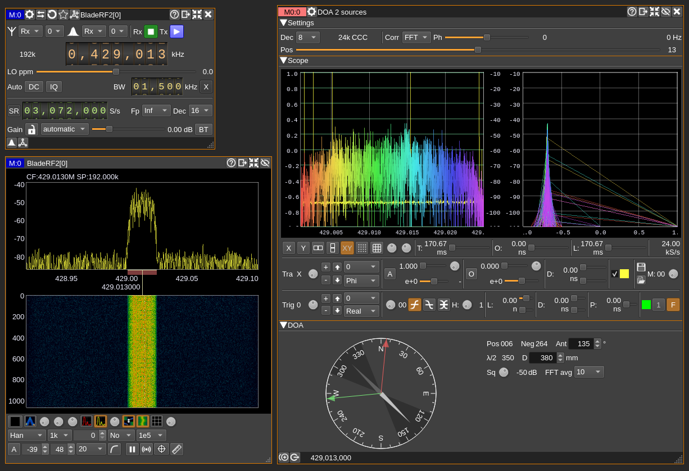
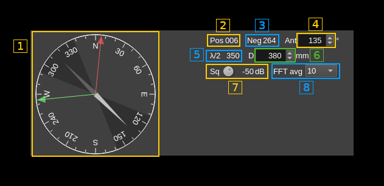
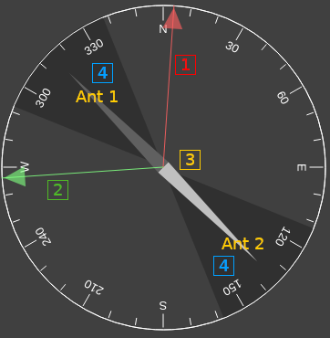
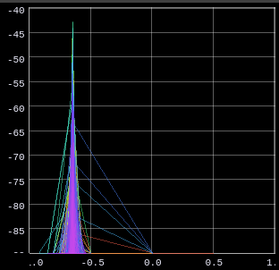
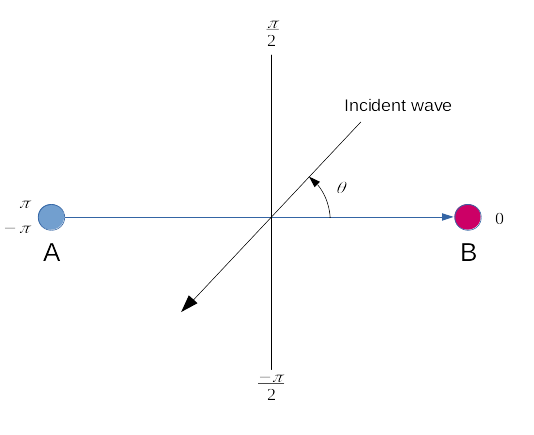
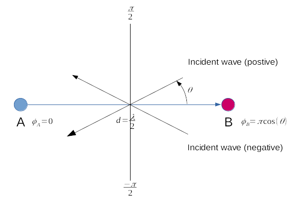
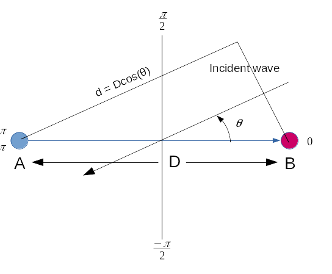

<h1>DOA with 2 sources plugin</h1>

<h2>Introduction</h2>

This MIMO reception only (MI) plugin can be used to determine the direction of arrival (DOA) of an incoming wave on a 2 antenna system connected to a coherent dual receiving device in MIMO (thus MI) mode like BladeRF3, LimeSDR USB, Pluto+. It is assume that antenna 1 is connected to stream 0 and antenna 2 is connected to stream 1. The direction of the antenna system goes from antenna 1 to antenna 2.

Example of setup:

This plugin has similarities with the [Interferometer plugin](../interferometer/readme.md) upon which it is built but is specialized in DOA processing and has displays and controls added in the "DOA" section. Also there is no spectrum display as it is of little interest for this purpose.

<h2>Interface</h2>

The top and bottom bars of the channel window are described [here](../../../sdrgui/channel/readme.md)

The interface is divided in 3 sections that will be detailed next:
  - A: settings. These are the general plugin controls
  - B: scope. This is a scope display analogous to other scope displays. I can show the A (stream 0) input, the B (stream 1) input or FFT (correlation for DOA). In the FFT case This is not a time domain but a frequency domain display transposed to time analogous to a frequency sweep. Therefore on the X and XY displays the time scale is replaced by a frequency scale.
  - C: DOA specific section

<h2>A. Settings section</h2>

<h3>A.1. Decimation</h3>

Input streams from baseband are decimated by a power of two. Use this combo to select from 0 (no decimation) to 64 (2^6). The resulting channel sample rate is displayed next (A.2)

<h3>A.2. Channel sample rate</h3>

This is the channel sample rate in kilo or mega samples per second indicated by the `k` or `M` letter.

<h3>A.3. Half-band filter chain sequence display</h3>

This string represents the sequence of half-band filters used in the decimation from device baseband to channel stream and controlled by (A.7). Each character represents a filter type:

  - **L**: lower half-band
  - **H**: higher half-band
  - **C**: centered

<h3>A.4. Correlation function</h3>

This combo selects which function is applied to A and B channel inputs to obtain resulting correlation signal.
  - **A**: A channel only (no correlation thus no DOA processing)
  - **B**: B channel only (no correlation thus no DOA processing)
  - **FFT**: The FFT of A is multiplied by the conjugate of the FFT of B (no IFFT) thus the result is in the frequency domain. This is sometimes called "interspectrum". This is used to evaluate the direction of arrival (DOA) of a plane wave which is the purpose of this plugin. Note that DOA processing is active only in this mode.

<h4>Scope inputs</h4>

The scope display inputs vary depending on the correlation types and are summarized in the table below:

<table>
<tr>
    <th>Correlation type</th>
    <th>Scope</th>
</tr>
<tr>
    <td>A</td>
    <td>A(t)</td>
</tr>
<tr>
    <td>B</td>
    <td>B(t)</td>
</tr>
<tr>
    <td>FFT</td>
    <td>FFT(A)*FFT(B)* possibly shows several FFT lengths on the scope (B) depending on trace length. Leave the default trace length to get accurate frequency readings on the X scale</td>
</tr>
</table>

<h3>A.5. Phase difference correction</h3>

This is the phase correction in degrees applied to signal in channel B.

<h3>A.6 Center frequency shift</h3>

This is the shift of the channel center frequency from the device center frequency. Its value is driven by the baseband sample rate, the decimation factor (A.1) and the filter chain sequence (A.7).

<h3>A.7. Half-band filter chain sequence adjust</h3>

The slider moves the channel center frequency roughly from the lower to the higher frequency in the device baseband. The number on the right represents the filter sequence as the decimal value of a base 3 number. Each base 3 digit represents the filter type and its sequence from MSB to LSB in the filter chain:

  - **0**: lower half-band
  - **1**: centered
  - **2**: higher half-band

<h3>A.8. Center filter in passband</h3>

Use this button to center the filter in the middle of the passband automatically. This sets all filters to center i.e CCC...

The resulting filter chain sequence is represented in (A.3)

<h2>B. Scope display</h2>

This is the scope (mainly time domain) display. This display and controls are identical to all scope displays in the software. Further details can be found in [Channel Analyzer documentation](../../channelrx/chanalyzer/readme.md)

See the principle of operation section below for optimum scope settings.

<h2>C. DOA settings</h2>

<h3>C.1 Compass readings</h3>

<h4>C.1.1 Port side incoming wave</h4>

The red arrow shows the direction of the incoming wave assuming it is ccoming from the port side of the antenna system (antenna 1 to 2). The value in degrees is displayed in (C.2).

This also corresponds to positive angles in the trigonometric sense with respect to the antenna baseline.

<h4>C.1.2 Starboard side incoming wave</h4>

The green arrow shows the direction of the incoming wave assuming it is ccoming from the starboard side of the antenna system (antenna 1 to 2). The value in degrees is displayed in (C.3).

This also corresponds to negative angles in the trigonometric sense with respect to the antenna baseline.

<h4>C.1.3 Compass needle</h4>

The compass needle shows the antennas direction with the white arrow towards antenna 2 and the grey arrow towards antenna 1. The direction (azimuth) is set with control (C.4). You must update this direction when the direction of the antenna system changes to get accurate readings.

<h4>C.1.4 Blind sector</h4>

The darker area on the compass background shows the sector where no readings can be made when the distance between the two antennas (baseline distance set in C.6) is larger than the half of the wavelength displayed in (C.5). Check the principle of operation section at the ned of the document for details.

<h3>C.2 Positive DOA angle (Port side)</h3>

Displays the posiive azimuth in degrees with respect to antenna direction of the incoming wave. This corresponds to the port side with respect to the antenna system from antenna 1 to antenna 2. This direction is displayed with a red arrow on the compass (1).

<h3>C.3 Negative DOA angle (Starboard side)</h3>

Displays the negative azimuth in degrees with respect to antenna direction of the incoming wave. This corresponds to the starboard side with respect to the antenna system from antenna 1 to antenna 2. This direction is displayed with a green arrow on the compass (1).

<h3>C.4 Antenna system azimuth</h3>

This is the direction in degrees of the antenna system from antenna 1 to antenna 2. You must update this value when the direction of the antenna system changes to get accurate readings.

<h3>C.5 Half wavelength distance in mm</h3>

This displays the half wavelength distance in millimeters at the center of frequency of reception.

<h3>C.6 Antenna baseline distance in mm</h3>

This is the distance in millimeters between antenna 1 and antenna 2. You must update this value when the distance between antennas change to get accurate readings.

<h3>C.7 Squelch threshold</h3>

This is the threshold of squared magnitude in dB above which DOA processing takes place. You can use the scope display in XY mode to find the best value.

In this exaple setting a squelch value of -55~-50 dB will select the narrow peak corresponding to samples giving the most accurate DOA measurements.

This threshold can also be used with transient signals to activate DOA processing only when the signal is present effectively acting like a squelch in FM modes.

<h3>C.8 FFT Averaging</h3>

This is the number of FFT series used for DOA calculation thus the weighting average is computed over this many FFTs. The tooltip shows the averaging time to obtain one result.

<h2>Principle of operation</h2>

DOA estimation is based on the "FFT" correlation funtion and active only when selected with (A.2). FFT analysis helps in removing non essential contributions and is more efficient than simple product wutn conjugate (A.B*).

It assumes that channel A is connected to antenna 1 or antenna of reference (device stream 0) and channel B is connected antenna 2 the second antenna (device stream 1) in the following configuration:

<h3>Configuring the scope dsisplay</h3>

The scope shall be configured to have X and Y displays with Y1 set to a magnitude display projection and X to a phase related projection. See scope controls in B section for setup. Here are the different possibilities:
  - **X**: Phi, DOAP, DOAN
  - **Y1**: Mag, MagSq, MagDB (this one is usually the most convenient)

You will select the XY display on the scope and you can use the polar grid display to show phase or direction angles with respect to the antenna system directly. Note that for direction modes DOAP or DOAN a distance of half wavelength is assumed between antennas.

Angles are counted from -&pi; to &pi; and normalized to &pi; for display thus displayed from -1.0 to 1.0 on the scope.

<h3>DOA processing</h3>

The phase difference &phi; between the reference signal A (antenna 1) and second signal B (antenna 2) and seen on scope X display with `Phi` selected is used to estimate the direction of arrival (DOA) of the incoming wave. For a given phase difference the wave may come from the positive side (port side) of angles (0 to &pi;) or the negative side (starboard side) (-&pi; to 0). Angles of arrival are referenced to the axis perpendicular to the axis passing by the two antennas.

Thus when antennas are separated by half the wavelength the relation between the angle of arrival &theta; and the phase difference &phi; can be expressed as:

&phi; = &pi; cos(&theta;) thus &theta; = acos(&phi; / &pi;)

This angle can be displayed on the scope when `DOAP` (positive angles) or `DOAN` (negative angles) is selected for X input.

In general the angle can be calculated from the baseline distance D (distance between antennas) with the following formula:

&phi; = &pi; d / (&lambda;/2)
&phi; = &pi; D cos(&theta;) / (&lambda;/2)
cos(&theta;) = (&phi; / &pi;) . ((&lambda;/2) / D)

If D is larger than half the wavelength (&lambda;/2) then a section in front of antenna 2 and at the back of antenna 1 cannot be reached since cos(&theta;) will lie in an interval smaller than [-1:1]. This section is shown on the compass with a darker background (C.1.4)

If D is smaller than half the wavelength some incorrect values can be read as some angles will ovelap. Unless you have a hint about the wave direction this mode of operation is not recommended,

There are two possible angles for the incoming wave leading to the same phase difference. One from the port side of the antenna system (positive) and the other from the starboard side (negative).

To disambiguate readings one may turn the antenna system then the correct side will show a constant absolute angle with respect to true North (or South).

For best results the antenna system should be clear of possible reflectors including your own body that can affect the incoming direct wave. Ideally you should also start the procedure with a distance between antennas (baseline distance) of half the wavelength of the signal of interest.

Then a possible procedure to determine DOA is the following:

1. Arrange antennas axis so that the phase difference &phi; is zero or DOA angle &theta; is roughly &pi;/2
2. Make an assumption for the wave to come from the positive (port) or negative (starboard) angles side and take it as the DOA angle
3. Rotate the antennas axis of about 45 degrees and if the DOA angle is roughly stable in absolute value then the assumption is correct and the wave is coming from the side corresponding to your assumption. You can then refine the antenna axis direction to obtain a &pi;/2 or -&pi;/2 angle depending from which side the wave is coming. The red arrow on the compass (C.1.1) shows the absolute direction of the wave coming from the port side and the green arrow (C.1.2) shows the absolute direction of the wave coming from the starboard side assuming that the direction of the antennas is set properly and follows the antennas system movement (C.4).
4. If when performing previous step (3) the DOA angle is significantly moving in absolute value then the wave is coming from the opposite side of the antenna system. Then take the other side angle reading as valid.
5. Once the  &plusmn;&pi;/2 DOA angle (zero phase difference) is obtained at &lambda;/2 distance between antennas you can move your antennas further apart to refine the &plusmn;&pi;/2 DOA angle.

