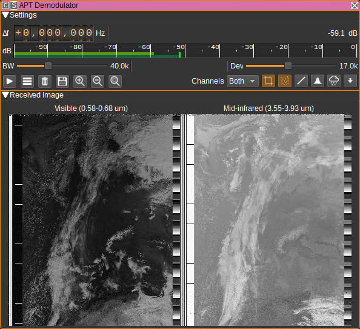
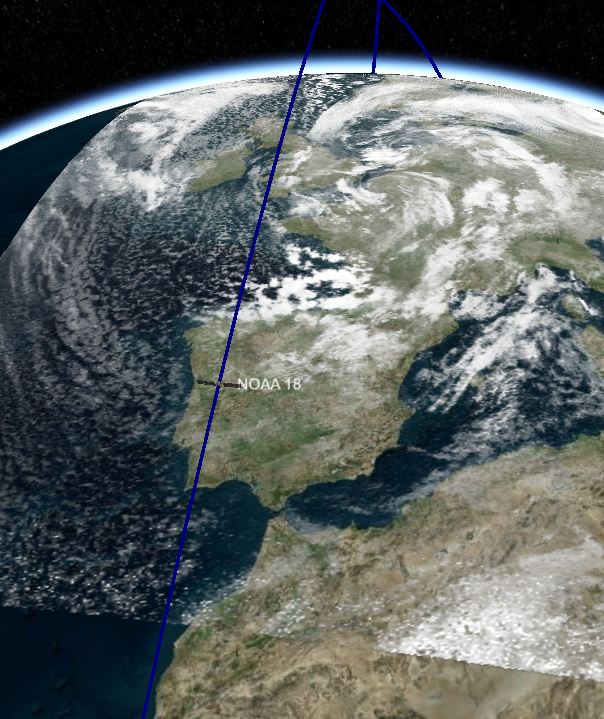
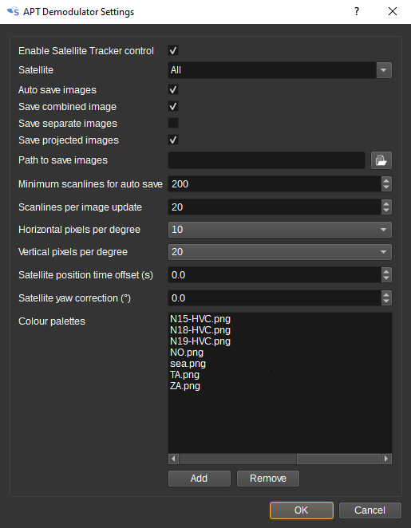

<h1>APT Demodulator Plugin</h1>

<h2>Introduction</h2>

This plugin can be used to demodulate APT (Automatic Picture Transmission) signals transmitted by NOAA POES weather satellites. These images are at a 4km/pixel resolution in either the visible, near-IR, mid-IR or thermal-IR bands.

The received images can be sent to the Map feature to be projected on to the 3D globe (this requires the Satellite Tracker feature to be running and start the decode):

* NOAA 15 transmits on 137.620 MHz.
* NOAA 18 transmits on 137.912 MHz.
* NOAA 19 transmits on 137.100 MHz.

The status of the NOAA POES satellites is available at: https://www.ospo.noaa.gov/Operations/POES/status.html The instrument used to generate the APT images is the AVHRR (Advanced Very High Resolution Radiometer).

<h2>Interface</h2>

<h3>1: Frequency shift from center frequency of reception</h3>

Use the wheels to adjust the frequency shift in Hz from the center frequency of reception. Left click on a digit sets the cursor position at this digit. Right click on a digit sets all digits on the right to zero. This effectively floors value at the digit position. Wheels are moved with the mousewheel while pointing at the wheel or by selecting the wheel with the left mouse click and using the keyboard arrows. Pressing shift simultaneously moves digit by 5 and pressing control moves it by 2.

<h3>2: Channel power</h3>

Average total power in dB relative to a +/- 1.0 amplitude signal received in the pass band.

<h3>3: Level meter in dB</h3>

  - top bar (green): average value
  - bottom bar (blue green): instantaneous peak value
  - tip vertical bar (bright green): peak hold value

<h3>4: RF Bandwidth</h3>

This specifies the bandwidth of a LPF that is applied to the input signal to limit the RF bandwidth. APT signals are nominally 34kHz wide, however, this defaults to 40kHz to allow for some Doppler shift.

<h3>5: Frequency deviation</h3>

Adjusts the expected frequency deviation in 0.1 kHz steps from 10 to 25 kHz. The typical value for APT is 17 kHz.

<h3>6: Transparency and Opacity Thresholds</h3>

For images displayed on the Map, these dials set the greyscale levels below which a pixel will be fully transparent and above which will be fully opaque. In between these values, pixels will be partially transparent. The opacity threshold should be greater or equal to the transparency threshold.

These settings can be used to remove land and sea from the APT image, which are typically at lower greyscale levels than cloud, allowing the 3D map surface to be visible, underneath the cloud.

<h3>7: Delete Images from Map</h3>

When clicked deletes any images added to the map by this demodulator.

<h3>8: Start/stop decoding</h3>

Starts or stops decoding. A maximum of 3000 scanlines can be decoded, after which, the Reset Decoder (10) button needs to be pressed, to start a new image.

<h3>9: Show settings dialog</h3>

When clicked, shows additional APT Demodulator settings.

This includes:

   - Whether the APT demodulator can be controlled by the Satellite Tracker feature. When checked, the image decoder will be enabled and reset on AOS and the satellite pass direction will be used to control image rotation. The decoder will be stopped on LOS.
   - Which satellites the APT demodulator will respond to AOS and LOS indications from the Satellite Tracker. This can be used to simulataneously decode images from multiple satellites, by having multiple instances of the APT Demodulator and setting a unique satellite name for each demodulator.
   - Whether to automatically save images on LOS.
   - Whether a combined image including telemetry should be saved.
   - Whether separate images of channel A and B, without telemetry, should be saved.
   - Whether equidistant cylindrical (plate carrée) project images used for the map, should be saved.
   - Path to save automatically saved images in.
   - The minimum number of scanlines required to be in an image, after noise cropping, for it to be automatically saved.
   - After how many scanlines image processing is applied and updates sent to the map. Lower values require more CPU power.
   - The number of pixels per degree longitude and latitude (i.e. resolution) for the equidistant cylindrical projected images.
   - Satellite time and yaw offsets that can be used to more precisely align the image projected on the map.
   - A list of colour palettes. Colour palettes are 256x256 image files that are used to enhance various features within an image. Some examples are here: https://github.com/Xerbo/aptdec/tree/master/palettes

<h3>10: Reset decoder</h3>

Clears the current image and restarts the decoder. The decoder must be reset between passes of different satellites.

<h3>11: Save image to disk</h3>

Saves the current image to disk. Images can be saved in PNG, JPEG, BMP, PPM, XBM or XPM formats.

<h3>12: Zoom in</h3>

Zooms in to the image. You can also zoom in with the scroll wheel.

<h3>13: Zoom out</h3>

Zooms out from the image. You can also zoom out with the scroll wheel.

<h3>14: Zoom image to fit</h3>

Zooms so that the image fits in to the available space.

<h3>15: Image selection</h3>

Selects whether:

   - both channels are displayed
   - only channel A is displayed
   - only channel B is displayed
   - a temperature map is displayed
   - colour palettized images are displayed

Temperature maps require enough scanlines to have been received in order to determine calibration data. Until then, the image will appear blank.
The temperature range of the image is from -100C to 60C. Moving the cursor over image will display the temperature under the cursor at the bottom of the legend.

![Temperature map] (../../../doc/img/APTDemod_plugin_temperature.png)

The colour palettes that are available are set in the APT Demodulator settings dialog (9).

<h3>16: Crop noise</h3>

When checked, noise is cropped from the top and bottom of the image. This is noise that is typically the result of the satellite being at a low elevation.

<h3>17: Apply denoise filter</h3>

When checked, a denoise filter is applied to the received image.

<h3>18: Apply linear equalisation</h3>

When checked, linear equalisation is performed, which can enhance the contrast. The equalisation is performed separately on each channel.

<h3>19: Apply histogram equalisation</h3>

When checked, histogram equalisation is performed, which can enhance the contrast. The equalisation is performed separately on each channel.

<h3>20: Overlay precipitation</h3>

When checked, precipitation is detected from the IR channel and overlayed on both channels using a colour palette.

This option will not work if linear (18) or histogram equalisation (19) has been applied.

<h3>21: Pass direction</h3>

The pass direction check button should be set to match the direction of the satellite pass.
i.e. select down arrow for satellite passing from the North to the South and the up arrow for the satellite passing from the South to the North.
This will ensure the image has the Northern latitudes at the top of the image.
This can be set automatically by the Satellite Tracker feature.

<h2>Attribution</h2>

This plugin uses libapt, part of Aptdec by Thierry Leconte and Xerbo, to perform image decoding and processing: https://github.com/Xerbo/aptdec

Icons are by Freepik from Flaticon https://www.flaticon.com/

Icons are by Hare Krishna from the Noun Project Noun Project: https://thenounproject.com/
