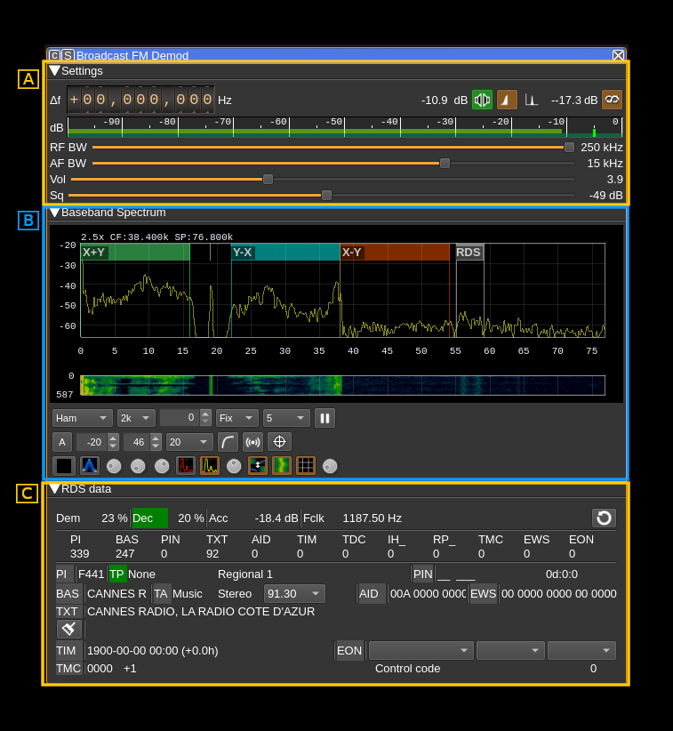
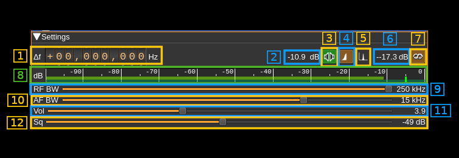
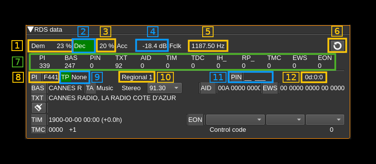

<h1>BFM demodulator plugin</h1>

<h2>Introduction</h2>

This plugin can be used to listen to a Broadcast FM modulated signal (BFM). In addition it can decode RDS data when available.

<h2>Interface</h2>

The main three areas are:

  - **A**: radio settings
  - **B**: spectrum of FM demodulated signal. Please note that the annotations are custom and not generally available. Controls are similar to other spectrum displays including the main spectrum display.
  - **C**: RDS data. Note that decoding RDS data requires the locking to the stereo pilot carrier therefore you should switch to stereo (A.3) to be able to decode RDS data

<h2>A: Radio settings</h2>

<h3>A.1: Frequency shift from center frequency of reception</h3>

Use the wheels to adjust the frequency shift in Hz from the center frequency of reception. Left click on a digit sets the cursor position at this digit. Right click on a digit sets all digits on the right to zero. This effectively floors value at the digit position. Wheels are moved with the mousewheel while pointing at the wheel or by selecting the wheel with the left mouse click and using the keyboard arrows. Pressing shift simultaneously moves digit by 5 and pressing control moves it by 2.

<h3>A.2: Channel power</h3>

Average total power in dB relative to a +/- 1.0 amplitude signal received in the pass band.

<h3>A.3: Mono/Stereo</h3>

Toggle between mono and stereo. The button lights in green if stereo is effectively active.

<h3>A.4: Stereo DSB or LSB</h3>

Some stations send only the lower side band of the stereo difference AM signal. This button let you select between lower or double side bands. Inspect the baseband spectrum (B) to tell if stereo is sent in LSB or DSB mode.

<h3>A.5: Show FM signal or pilot carrier on spectrum</h3>

This button let you select the spectrum display between the FM signal and the 38 kHz pilot signal to visualize its quality.

<h3>A.6: Stereo pilot power</h3>

This is the power of the reconstructed stereo pilot signal.

<h3>A.7: Toggle RDS decoding</h3>

USe this button to activate or de-activate RDS decoding

<h3>A.8: Level meter in dB</h3>

  - top bar (green): average value
  - bottom bar (blue green): instantaneous peak value
  - tip vertical bar (bright green): peak hold value

<h3>A.9: RF Bandwidth</h3>

This is the bandwidth in kHz of the channel signal before demodulation. It can be set in steps: 80, 100, 120, 140, 160, 180, 200, 220 and 250 kHz. Inspect the baseband spectrum (B) to adjust for best quality.

<h3>A.10: AF bandwidth</h3>

This is the AF bandwidth in kHz. It can be varied continuously between 1 and 20 kHz in steps of 1 kHz.

<h3>A.11: AF volume</h3>

This is the relative AF volume from 0 to 10.

<h3>A.12: Squelch</h3>

Adjust squelch in dB.

<h2>C: RDS display</h2>

<h3>C.1: Demodulator quality</h3>

DBPSK demodulator quality (0-100%)

<h3>C.2: Decoder synchronization</h3>

This indicator lights up (in green) when decoder acquires synchronization

<h3>C.3: Decoder quality</h3>

Decoder synchronization quality (0-100%)

<h3>C.4: Sample symbol power</h3>

Reconstructed sample symbol power in dB.

<h3>C.5: Symbol clock frequency</h3>

The RDS data rate is 1187 b/s therefore the clock frequency should be as close as possible to 1187 Hz.

<h3>C.6: Clear RDS data</h3>

Clear all RDS data.

<h3>C.7: Message types counters</h3>

Shows counters of received message by type.

  - **PI**: Program Identification (C.8)
  - **BAS**: BASic information (program service name - C.13)
  - **PIN**: Program Item Number (C.11)
  - **TXT**: TeXT message fragments (C.20, C.22)
  - **AID**: Application Information Data (C.18)
  - **TIM**: TIMe information (C.23)
  - **TDC**: Transparent Data Channel
  - **IH_**: In House applications
  - **RP_**: Radio Paging
  - **TMC**: Traffic Message Channnel (C.28)
  - **EWS**: Emergency Warning System (C.19)
  - **EON**: Enhanced Other Networks information (C.24, 25, 26, 27)

<h3>C.8: Proram Identification</h3>

The ¨PI" label lights up if a PI message is received.

<h3>C.9: Traffic Program identification</h3>

The "TP" label lights up if a TP message is received. Next is the program type.

<h3>C.10: Program coverage</h3>

<h3>C.11: Program Item Number</h3>

The "PIN" label lights up if a PIN message is received next is the country code and language.

<h3>C.12: Day hour and minutes</h3>

<h3>C.13: Program service name</h3>

The "BAS" indicator lights up if a BAS message is received. Next os the program service name

<h3>C.14: Trafic Announcement identification</h3>

The "TA" indicator lights up if a TA message is received

<h3>C.15: Music/Speech</h3>

Music/Speech indicator

<h3>C.16: Mono/Stereo</h3>

Mono/Stereo indicator

<h3>C.17: Alternate frequencies</h3>

List of alternate frequencies in MHz

<h3>C.18: Application Information Data</h3>

The "AID" indicator lights up if a AID message is received. Next is the application information data

<h3>C.19: Emergency Warning System</h3>

The "EWS" indicator lights up if a EWS message is received. Next is the emergency warning system raw data

<h3>C.20: Curent text line</h3>

The "TXT" indicator ligths up if a text element is received. Next the current radio text line is displayed.

<h3>C.21: Clear previous text line</h3>

Push this button the clear the previous text line next (C.22)

<h3>C.22: Previous text line</h3>

Previous radio text line. The current line (C.20) is moved there when the message switch has been received.

<h3>C.23: Time</h3>

Some stations send the clock time at regular intervals. The "TIM" indicator lights up when a time message is received. The date and time is displayed next with the time zone shift from GMT.

<h3>C.24: Enhanced Other Networks</h3>

The "EON" indicator lights up when a EON message is received. The EON data is displayed next (C.25, C.26 and C.27).

<h3>C.25: EON station data</h3>

Station data: program PI and service names list.

<h3>C.26: EON frequencies</h3>

Station frequencies list.

<h3>C.27: EON alernate frequencies</h3>

Station alternate frequencies list.

<h3>C.28: Traffic Message Channel</h3>

The "TMC" indicator lights up if a TMC message is received. Next is the location and content of the event reported in the message.
