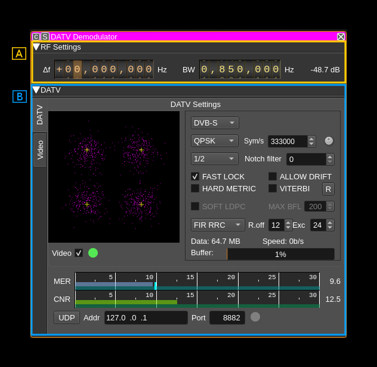
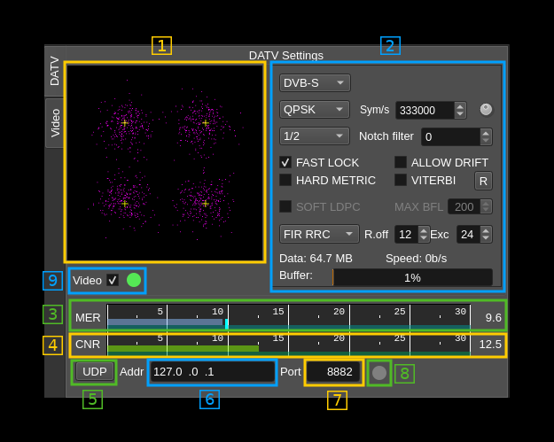
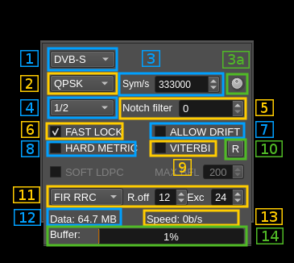

<h1>DATV demodulator plugin</h1>

<h2>Specific dependencies</h2>

  - ffmpeg
  - libavcodec-dev
  - libavformat-dev

[LeanSDR](https://github.com/pabr/leansdr) framework from F4DAV is intensively used. It has been integrated in the source tree and modified to suit SDRangel specific needs.

<h2>Introduction</h2>

This plugin can be used to view digital amateur analog television transmissions a.k.a DATV. The only supported standard for now is DVB-S in various modulations. The standard modulation is QPSK but experimental configurations with other PSK modulations (BPSK, 8PSK, QAMn) can be selected.

The whole bandwidth available to the channel is used. That is it runs at the device sample rate possibly downsampled by a power of two in the source plugin.

&#9888; Note that DVB-S2 support is experimental. You may need to move some settings back and forth to achieve constellation lock and decode. For example change mode or slightly move back and forth center frequency.

<h2>Interface</h2>

The top and bottom bars of the channel window are described [here](../../../sdrgui/channel/readme.md)

<h3>A: RF settings</h3>

<h4>A.1: Channel frequency shift</h4>

This is the shift of channel center frequency from RF passband center frequency

<h4>A.2: RF bandwidth</h4>

Sets the bandwidth of the channel filter

<h4>A.3: Channel power</h4>

Power of signal received in the channel (dB)

<h3>B: DATV section</h3>

<h4>B.3: MER estimation</h4>

This gauge gives the MER estimation. The averaged value appears on the right.

<h4>B.4: CNR estimation</h4>

This gauge gives the CNR estimation. The averaged value appears on the right. Estimation is made comparing spectrum power in the center of the passband compared to the sides. The passband is the one presented to the demodulator and is always twice the symbol rate. the "center" is estimated at 60% of the full passband. Note that the RF filter comes before that and may change the aspect of the spectrum thus the best estimation is obtained when the RF filter width is close to twice the symbol rate and the surroundings are quiet.

<h4>B.5: Output transport stream to UDP</h4>

Activate output of transport stream to UDP with 7 TS blocks per UDP frame

<h4>B.6: UDP address</h4>

This is the address of the TS UDP

<h4>B.7: UDP port</h4>

This is the port of the TS UDP

<h4>B.8: UDP streaming indicator</h4>

Indicator turns green if UDP data is streaming to destination

<h4>B.9: Video player enable and indicator</h4>

Use the checkbox to enable or disable the internal video player. The indicator next turns green if the video player thread is active.

Use this control to disable the video player if it causes too many crashes...

<h4>B.1: Symbol constellation</h4>

This is the constellation of the PSK or QAM synchronized signal. When the demodulation parameters are set correctly (modulation type, symbol rate and filtering) and signal is strong enough to recover symbol synchronization the purple dots appear close to the white crosses. White crosses represent the ideal symbols positions in the I/Q plane.

<h4>B.2a: DATV signal settings (all standards)</h4>

<h5>B.2a.1: DATV standard</h5>

  - DVB-S: DVB-S
  - DVB-S2: DVB-S2 and some DVB-S2X

<h5>B.2a.2: Modulation type</h5>

Depends on the standard.

  - DVB-S: Normally only QPSK and BPSK (later addition) are supported in the standard but amateur radio use has a little bit abused of the standard so PSK6, QAM16, QAM64 and QAM256 are also supported
  - DVB-S2: QPSK, PSK8, APSK16, APSK32, APSK64e (DVB-S2X)

The constellations are as follows:

  - BPSK: binary phase shift keying. Symbols are in &#960;/4 and -3&#960;/4 positions.
  - QPSK: quadrature phase shift keying. Symbols are in &#960;/4, 3&#960;/4, -3&#960;/4 and -&#960;/4 positions.
  - PSK8: 8 phase shift keying a.k.a. &#960;/4 QPSK. Symbols are in 0, &#960;/4, &#960;/2, 3&#960;/4, &#960;, -3&#960;/4, -&#960;/2 and -&#960;/4 positions
  - APSK16: amplitude and phase shift keying with 16 symbols
  - APSK32: amplitude and phase shift keying with 32 symbols
  - APSK64e: amplitude and phase shift keying with 64 symbols
  - QAM16: quadrature amplitude modulation with 16 symbols
  - QAM64: quadrature amplitude modulation with 64 symbols
  - QAM256: quadrature amplitude modulation with 256 symbols

<h5>B.2a.3: Symbol rate</h5>

This controls the expected symbol rate in symbols per second

<h5>B.2a.3a: Set standard DATV symbol rate</h5>

Use this dial to flip through standard DATV symbol rates: 25, 33, 66, 125, 250, 333, 500, 1000, 1500, 2000 kSym/S

<h5>B.2a.4: FEC rate</h5>

Dpends on the standard and modulation

  - DVB-S with all modulations: 1/2 , 2/3 , 3/4, 5/6 and 7/8.
  - DVB-S2 and QPSK: 1/4, 1/3, 2/5, 1/2, 3/5, 2/3, 3/4, 4/5, 5/6, 8/9, 9/10
  - DVB-S2 and PSK8: 3/5, 2/3, 3/4, 5/6, 8/9, 9/10
  - APSK16 (DVB-S2): 2/3, 3/4, 4/5, 5/6, 8/9, 9/10
  - APSK32 (DVB-S2): 3/4, 4/5, 5/6, 8/9, 9/10
  - APSK64E (DVB-S2): 4/5, 5/6

<h5>B.2a.5: Notch filter</h5>

LeanSDR feature: attempts to fix signal spectrum shape by eliminating peaks. This is the number of peaks to be tracked. It is safer to keep the 0 default (no notch).

<h5>B.2a.6: Fast lock (DVB-S only)</h5>

Faster signal decode but may yield more errors at startup.

<h5>B.2a.7: Allow drift (DVB-S only)</h5>

Small frequency drift compensation.

<h5>B.2a.8: Hard metric (DVB-S only)</h5>

Constellation hardening (LeanSDR feature).

<h5>B.2a.9: Viterbi (DVB-S only)</h5>

Viterbi decoding. Be aware that this is CPU intensive. Should be limited to FEC 1/2 , 2/3 and 3/4 in practice.

<h5>B.2a.10: Reset to defaults</h5>

Push this button when you are lost...

<h5>B.2a.11: Filter</h5>

  - FIR Linear
  - FIR Nearest
  - RRC (Root Raised Cosine).

  When RRC is selected the additional controls for roll-off factor (%) and envelope excursion (dB) are effective. The lower the roll-off factor the steeper the sides of the filter. A higher value of the envelope excursion may help on weak signals.

  Practically the RRC filter is mandatory for proper decoding of normal to weak signals. Strong signals may decode in any condition.

<h5>B.2a.12: Amount of data decoded</h5>

Amount data received in the video player. If the video player is disabled this is the amount of data sent via UDP. Automatically adjusts unit (kB, MB, ...)

<h5>B.2a.13: Stream speed</h5>

Current data flow in the video player. If the video player is disabled this is the flow sent via UDP.

<h5>B.2a.14: Buffer status</h5>

Gauge that shows percentage of video player buffer queue length

<h4>B.2b: DATV signal settings (DVB-S2 specific)</h4>

<h5>B.2b.3: MODCOD status</h5>

In addition to the controls a MODCOD status text appears on the right of the standard selector (1) that give the mode and code rate as retrieved from MODCOD information. When the MODCOD information has triggered the automatic mode and rate selection (2) and (4) the text background turns to green.

<h5>B.2b.2 and 4: Mode and rate selection</h5>

The mode and rate selection can be done manually but if a discrepancy in the number of bits per symbol appears compared to the MODCOD information then the MODCOD information takes precedence and the selection is changed automatically and the status background (3) turns to green.

<h5>B.2b.5: DVB-S specific controls</h5>

The controls specific to DVB-S are disabled and greyed out. These are: Fast Lock, Allow Drift, Hard Metric and Viterbi.

<h5>B.2b.6: DVB-S2 specific - Soft LDPC decoder</h5>

It can be used to decode signals lower that ~10 db MER which is the limit of LDPC hard decoding as explained next (B.2b.7). Video degrades progressively down to about 7.5 dB MER and drops below this limit.

Right clicking on this control opens a dialog where you can choose:

  - The `ldpctool` executable. Obsolete.
  - The maximum of retries in LDPC decoding from 1 to 8.

<h5>B.2b.7: DVB-S2 specific - LDPC maximum number of bit flips allowed</h5>

May vary between 0 and 500. On strong signals (17 dB SNR or more) you may set it to 0 thus saving processing on occasional bit flips that will not cause significant degradation. When SNR decreases you may set it to a medium value of about 200 allowing bit flips corrections to take place and decoding of signals down to about 10dB MER. A higher value towards the maximum (500) will not make a significant difference and is allowed mostly for experimentation.

If you have enough processing power it is fine to always leave it at 200.

Comparatively:
  - with max = 0 you need ~15 dB MER which corresponds to ~16 dB CNR
  - with max = 200 you need ~10 dB MER which corresponds to ~13 dB CNR

<h3>C: DATV video stream</h3>

<h4>C.1: Image</h4>

The decoded video is displayed here

<h4>C.2: Stream information</h4>

<h4>C.3: Stream decoding status</h4>

These non clickable checkboxes report the decoding status (checked when OK):

  - data: reception on going
  - transport: transport stream detected
  - video: video data detected
  - decoding: video being decoded

<h4>C.4: Video mute</h4>

Toggle button to pause/run video decoding. This also indicates the video status:

  - Grey (no color): there is no video stream
  - Green: a video stream is present and successfully decoded
  - Red: a video stream is present but decoding fails

<h4>C.5: Audio mute</h4>

Toggle button to pause/run audio decoding. This also indicates the audio status:

  - Grey (no color): there is no audio stream
  - Green: an audio stream is present and successfully decoded
  - Red: an audio stream is present but decoding fails

In addition right clicking on the button will give you access to the audio device selection dialog

<h4>C.6: Audio volume</h4>

Show the audio volume on a 0 to 100 scale. The actual coefficient applied to the audio samples follows a logarithmic rule where 0 corresponds to 0.01, 50 to 0.1 and 100 to 1.0

<h4>C.7: Audio volume control</h4>

Use this slider to control the value (0 to 100) of the audio volume.

