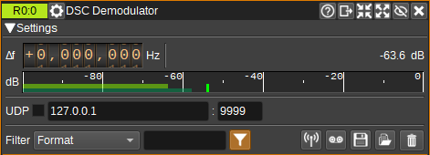
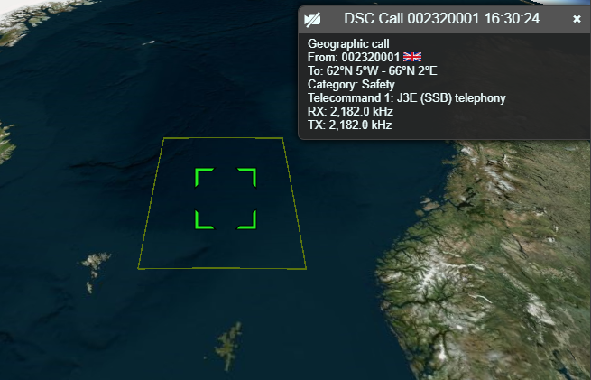

<h1>DSC (Digital Selective Calling) Demodulator Plugin</h1>

<h2>Introduction</h2>

This plugin can be used to demodulate DSC (Digital Selective Calling) transmissions, which are short, pre-defined digital messages transmitted by marine radios.

DSC messages are transmitted using FSK with 170Hz separation at 100 baud, as specified by [ITU-R M.493](https://www.itu.int/dms_pubrec/itu-r/rec/m/R-REC-M.493-15-201901-I!!PDF-E.pdf]).

DSC messages can be transmitted on a variety of frequencies, but are most commonly found on: 2,187.5kHz, 8,414.5kHz, 16,804.5kHz and 156.525 MHz (VHF Ch. 70).

<h2>Interface</h2>

The top and bottom bars of the channel window are described [here](../../../sdrgui/channel/readme.md)

<h3>1: Frequency shift from center frequency of reception</h3>

Use the wheels to adjust the frequency shift in Hz from the center frequency of reception. Left click on a digit sets the cursor position at this digit. Right click on a digit sets all digits on the right to zero. This effectively floors value at the digit position. Wheels are moved with the mousewheel while pointing at the wheel or by selecting the wheel with the left mouse click and using the keyboard arrows. Pressing shift simultaneously moves digit by 5 and pressing control moves it by 2.

<h3>2: Channel power</h3>

Average total power in dB relative to a +/- 1.0 amplitude signal received in the pass band.

<h3>3: Level meter in dB</h3>

  - top bar (green): average value
  - bottom bar (blue green): instantaneous peak value
  - tip vertical bar (bright green): peak hold value

<h3>4: UDP</h3>

When checked, received messages are forwarded to the specified UDP address (5) and port (6).

<h3>5: UDP address</h3>

IP address of the host to forward received messages to via UDP.

<h3>6: UDP port</h3>

UDP port number to forward received messages to.

<h3>7: Filter</h3>

This drop down displays a list of all columns which can be used for filtering (8).

<h3>8: Filter Reg Exp</h3>

Specifies a [regular expression](https://regexr.com/) used to filter data in the table, using data in the column specified by (7).

<h3>9: Filter Invalid</h3>

When checked, invalid messages will be filtered from the table.

<h3>10: Feed to YaDDNet</h3>

When checked, valid messages will be forwarded to [YaDDNet](http://yaddnet.org/).
YaDDNet aggregates DSC messages from different users around the world storing them in a searchable database.
The messages are submitted with Preferences > My Position... > Station name used as the ID.

Right click to open http://yaddnet.org/ in your browser, showing recent messages received from this ID.

<h3>11: Use Date and Time from File</h3>

When checked, if the source device is a File Input device, the date and time used for
packet reception time is taken from the file playback time. Otherwise, the current system clock time is used.

<h3>12: Start/stop Logging Messages to .csv File</h3>

When checked, writes all received messages to a .csv file, specified by (13).

<h3>13: .csv Log Filename</h3>

Click to specify the name of the .csv file which received messasges are logged to.

<h3>14: Read Data from .csv File</h3>

Click to specify a previously written .csv log file, which is read and used to update the table.

<h3>15: Received Messages Table</h3>

The received messages table displays the contents of the messages that have been received. Most of the fields are decoded directly from the message,
however, a few, such as ship names, are found by querying [aprs.fi](http://aprs.fi) with the MMSI.

* Date - Date the message was received.
* Time - Time the message was received.
* Format - The message format (Selective call, Geographic call, Group call, Distress alert, All ships, Automatic call).
* To - Who the message is to (The address field). This is typically an MMSI, but can also be a geographic area.
* Country - Country with jurisdiction of the destination of the message.
* Type - MMSI type of the destination of the message (Ship / Coast station).
* Name - The name of ship / station the message is for (From aprs.fi).
* Category - The message category (Safety, Routine, Urgency, Distress).
* From - MMSI of sender of message.
* Country - Country with jurisdiction of the sender of the message.
* Type - MMSI type of the sender of the message (Ship / Coast station).
* Name - The name of ship / station sending the message (From aprs.fi).
* Range (km) - The distance in kilometers from My Position (specified under Preferences > My Position) to the position of the sender of the message, as reported by aprs.fi (usually from AIS data).
* Telecommand 1 - First telecommand (Test / J3E (SSB) telephony and so on).
* Telecommand 2 - Second telecommand.
* RX - RX frequency (Hz) or channel.
* TX - TX frequency (Hz) or channel.
* Position - Position of ship in degrees and minutes.
* Distress Id - MMSI of ship in distress.
* Distress - Nature of distress (Sinking, Collision, Man overboard and so on).
* Number - Telephone number.
* Time - UTC Time.
* Comms - Subsequent communications.
* EOS - End of Signal (Req ACK, ACK, EOS).
* ECC - Indicates if calculated ECC (Error Checking Code) matches received ECC.
* Errors - Number of symbols received with errors (which may have been corrected if ECC is OK)
* Valid - Whether the message is determined to be valid (contains no detected errors).
* RSSI - Average channel power in dB, while receiving the message.

Right clicking on the header will open a menu allowing you to select which columns are visible.
To reorder the columns, left click and drag left or right a column header.
Left click on a header to sort the table by the data in that column.

Right clicking on a cell will open a pop-up menu that that allows:
* MMSIs to be looked up on some popular web sites,
* Ships to be located on the [Map](../../feature/map/readme.md) if also being tracked via AIS,
* Tune SSB Demods to the RX frequency or
* Geographical call areas to be drawn on the [Map](../../feature/map/readme.md):

