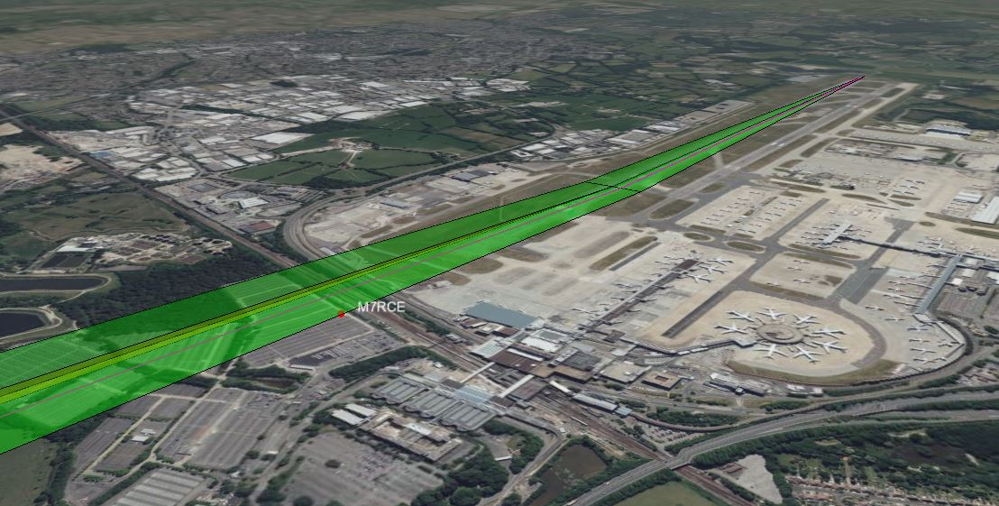
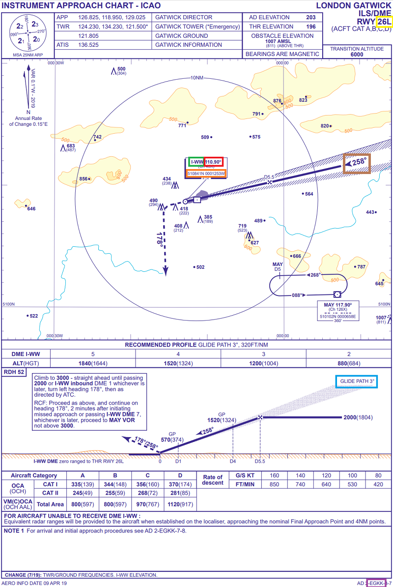
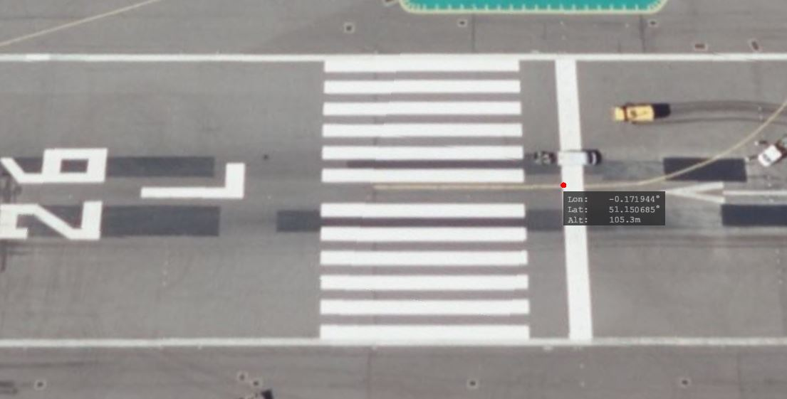
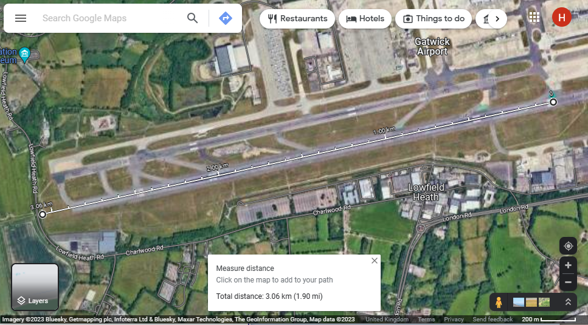

<h1>ILS Demodulator Plugin</h1>

<h2>Introduction</h2>

This plugin can be used to demodulate ILS (Instrument Landing System) signals. These are the signals
used by aircraft to perform precision approaches and auto-lands. Details of the demodulated signal are displayed,
such as the DDM (Difference in Depth of Modulation), as well as a visual representation of course line & glide path deviation on a
CDI (Course Deviation Indicator), similar to that used in aircraft.

The ILS localizer course and glide path can be displayed in 3D on the [Map](../../feature/map/readme.md) feature.

Two independent signals are transmitted as part of ILS on different frequencies: The localizer (LOC) signal (at 108-112MHz) that gives guidance in the horizontal plane
and the glide slope (G/S) signal (at 329-335MHz) that gives guidance in the vertical plane.

Each signal contains 90Hz and 150Hz tones. A phased antenna array is used so that the relative strength of the tones to the carrier varies throughout space.
The tones will be equal (more specifically, the difference in depth of modulation (DDM) will be 0), along the localizer course line or glide path.
When approaching the localizer, the 90Hz tone will be stronger to the left and the 150Hz tone will be stronger to the right. Similarly, the 90Hz tone
will be stronger above the glide path, with the 150Hz being stronger below.

As the LOC and G/S signals are so far apart in frequency, in order to receive both simultaneously, two SDRs, each with their own ILS Demodulator, are required.
If you only have one SDR, you can demodulate either signal independently.

<h2>Interface</h2>

The top and bottom bars of the channel window are described [here](../../../sdrgui/channel/readme.md)

<h3>1: Frequency shift from center frequency of reception</h3>

Use the wheels to adjust the frequency shift in Hz from the center frequency of reception. Left click on a digit sets the cursor position at this digit. Right click on a digit sets all digits on the right to zero. This effectively floors value at the digit position. Wheels are moved with the mousewheel while pointing at the wheel or by selecting the wheel with the left mouse click and using the keyboard arrows. Pressing shift simultaneously moves digit by 5 and pressing control moves it by 2.

<h3>2: Channel power</h3>

Average total power in dB relative to a +/- 1.0 amplitude signal received in the pass band.

<h3>3: Level meter in dB</h3>

  - top bar (green): average value
  - bottom bar (blue green): instantaneous peak value
  - tip vertical bar (bright green): peak hold value

<h3>4: Mode</h3>

Specifies whether the ILS Localizer or Glideslope signal is to be demodulated. The localizer provides horizontal guidance and the glideslope vertical.

<h3>5: Frequency</h3>

Specifies the ILS frequency. This will be in the range 108-112 MHz. When a frequency is selected, the device will be tuned to the corresponding frequency.
Localizers use the same frequency as listed on aviation charts for the ILS.
Glideslopes using a paired frequency in the range 329-335MHz range, which is typically not displayed on charts.

<h3>6: RF Bandwidth</h3>

This specifies the bandwidth of a filter that is applied to the input signal to limit the RF bandwidth.
This should be set wide enough to contain the ILS and audio signal.
In some countries, offset carrier can be used, where the same signal is transmitted at multiple offsets. In this case, the
bandwidth should be set wide enough to cover all signals (E.g. ~16kHz).

<h3>7: Ident</h3>

Specifies the identifer for the ILS. This is typically 3 or 4 characters. The drop-down contains a number of identifiers for ILSs at
airports within the South East of the UK. Selecting one of these will automatically fill in the other fields with details of the ILS.
The ILS identifier is broadcast as Morse code at an offset of 1020Hz from the ILS carrier. This is demodulated and displayed below the CDI.

<h3>8: Latitude</h3>

Specifies the latitude of the runway threshold, in decimal degrees (North positive).

<h3>9: Longitude</h3>

Specifies the longitude of the runway threshold, in decimal degrees (East positive).

<h3>10: Elevation</h3>

Specifies the runway threshold elevation in feet. The correct elevation value may differ from the terrain height in the 3D map, depending on which terrain model is used (as set in the 3D map settings), so you may wish
to adjust this until the localizer is nicely displayed on the runway in the 3D map.

<h3>11: Runway</h3>

Specifies the airport ICAO and runway name. (E.g. EGKK 08R).

<h3>12: Bearing</h3>

Specifies the runway bearing in degrees true. This can be calculated from the runway course given on charts by adding the magnetic declination.

<h3>13: Slope</h3>

Specifies the runway slope in %.

<h3>14: Glide Path Angle</h3>

Specifies the glide path angle in degrees. For most ILS approaches, this is 3.0 degrees, but there are some exceptions, such as EGLC which is 5.5 degrees.

<h3>15: RD Height</h3>

Specifies the ILS Reference Datum Height (RDH) above the runway threshold in metres. (Also known as the Threshold Crossing Height (TCH)).

This is typically 15m (50ft) +/-3m (10ft), or 12m (40m) for short runways (<1200m).

<h3>16: Course Width</h3>

Specifies the localizer course width in degrees. This is typically between 3 and 6 degrees, with shorter runways having wider course widths.

<h3>17: UDP</h3>

When checked, the calculated DDM value is forwarded to the specified UDP address (18) and port (19) as a UTF-8 string.

<h3>18: UDP address</h3>

IP address of the host to forward DDM data to via UDP.

<h3>19: UDP port</h3>

UDP port number to forward DDM data to.

<h3>20: Average</h3>

When checked, a moving average filter is applied to the ILS data.

<h3>21: MT - Morse Threshold</h3>

This is the Morse code ident threshold, expressed as a linear signal to noise (SNR) ratio. This is effectively the signal level required for the Morse demodulator to detect a dot or dash. Setting this to low values will allow the Morse demodulator to detect weak signals, but it also increases the likelihood that noise will incorrectly be interpreted as a signal, resulting in invalid ident being reported.

<h3>22: Volume</h3>

This is the volume of the audio signal from 0.0 (mute) to 10.0 (maximum). It can be varied continuously in 0.1 steps using the dial button.

<h3>23: Squelch Threshold</h3>

This is the squelch threshold in dB. The average total power received in the signal bandwidth before demodulation is compared to this value and the squelch input is open above this value. It can be varied continuously in 0.1 dB steps from 0.0 to -100.0 dB using the dial button.

<h3>24: Start/stop Logging Data to .csv File</h3>

When checked, writes demodulated data to the .csv file specified by (25).

<h3>25: .csv Log Filename</h3>

Click to specify the name of the .csv file which data will be logged to.

<h3>26: Add Marker</h3>

Adds a marker to the map at the current GPS position, displaying current ILS data.

<h3>27: Clear Markers</h3>

Clears all markers from the map.

<h3>28: ILS Data</h3>

The ILS data area shows details of the demodulated signal.

<h3>29: DM90Hz</h3>

Displays the depth of modulation of the 90Hz tone as a percentage of the carrier.

<h3>30: DM150Hz</h3>

Displays the depth of modulation of the 150Hz tone as percentage of the carrier.

<h3>31: SDM</h3>

Displays the Sun of the Depth of Modulation of the 90 and 150Hz tones. For LOC, this should be 40%. For G/S it should be 80%.

<h3>32: DDM</h3>

Displays the Difference in the Depth of Modulation of the 90 and 150Hz tones (DDM=(DM90Hz-DM150Hz)/100). When the difference is 0,
the aircraft (or receiving antenna) will be aligned on the course line or glide path. For LOC, a positive DDM indicates the aircraft
is to the left of the course line, or for G/S, above the glide path.

<h3>33: Deviation ILS</h3>

Displays an estimate of the deviation angle based on the calculated DDM. Note that this angle may be very inaccurate for |ddm|>0.155, as outside of this value DDM is not linear with angle.

<h3>34: Deviation GPS</h3>

Displays a deviation angle calculated from GPS position, to be used as a reference in a comparison with the deviation angle computed from the ILS signals (33).

<h3>35: CDI</h3>

The Course Deviation Indicator plots course / glide path deviation in a way similar to that displayed in aircraft.
Full scale deviation is 2.5 degrees (centre to edge) for LOC and 0.35 degrees for G/S.
"LOC" will be displayed in green above the CDI when the localizer is captured (|DDM| < 0.175).
"G/S" will be displayed in green above the CDI when the glide slope is capture (|DDM| < 0.175).

The decoded Morse code identifier will be displayed underneath the CDI in both Morse and letters.
If will be displayed in white if it matches the specified identifer (7) or red if not.

<h3>36: Demodulated Spectrum</h3>

The spectrum displays the demodulated AM spectrum, which should show the carrier, 90Hz and 150Hz sidebands.

<h2>Setting up an ILS</h2>

First, find the approach charts (plates) for the runway/airport, or AIP (Aeronautical Information Publication) with the ILS of interest:

* UK - [NATS AIP](https://nats-uk.ead-it.com/cms-nats/opencms/en/Publications/AIP/)
* Europe - [EUROCONTROL AIP](https://www.ead.eurocontrol.int/cms-eadbasic/opencms/en/login/ead-basic/)
* USA - [FAA DTPP](https://www.faa.gov/air_traffic/flight_info/aeronav/digital_products/dtpp/)
* Flight simmers may have [Navigraph Charts](https://navigraph.com/)

This will contain the ILS identifier (green box), that should be entered in (7) and the frequency (red box) (5). It should also specify the glide path angle (blue box), to be entered in (14). That is typically 3 degrees.
The airport ICAO (purple box) and runway (yellow box) can be entered in (11).

Next, we need to enter the latitude (8), longitude (9) and elevation (10) of the runway threshold. This is available on some charts (orange box), but not usually accurately enough to line up perfectly on the 3D map.
For this, it's best to use the 3D map, and double click while holding shift at the start of the threshold to set a marker, which will display the coordinates.

The runway bearing should then be set (12) in degrees true. This is the runway course + magnetic declination. The easiest way to set this is just to enter the runway course from the chart (brown box), then visually
adjust the setting until the centre of the localizer (the course line) lines up with the runway centre line markings. Likewise, if necessary, the runway slope (13) can be set visually if needed.

The ILS Reference Datum Height (RDH) to be set in (15) can often be found in the AIP, and is typically 15m (50ft).

The course width (16) is ocassionaly specified in the AIP.

If not in the AIP, it may be possible to calculate it from an SBAS FAS Data Block if available:
* Calculate the distance between LTP (Landing Threshold Point) and FPAP (Fight Path Alignment Point) from
the coordinates and add 305m to calculate the distance, D, between LTP and GARP (GNSS Azimuth Reference Point).
* With W as the Course Width at the LTP in metres (which is typically 105m),
* Calculate course width angle as 2 * atan(W/D).

Alternatively, the course width angle can also be estimated by measuring the distance D above as the distance from
the the threshold to the localizer antenna, using a tool such as Google Maps (Right click on the map at the threshold and click Measure Distance
then left click on the localizer antenna).

If D is less than 2000m, the calculated angle will be greater than 6 degrees. In this case, 6 degrees should be used as the
course angle, as this is the specified maximum angle.

It should be noted that the GARP and localizer antenna aren't always coincident.

Finally, you can measure the GPS Deviation angle at the point at which DDM is 0.155, and then the course width is twice that.

(Please feel free to send me your settings so I can add them to the builtin database.)

