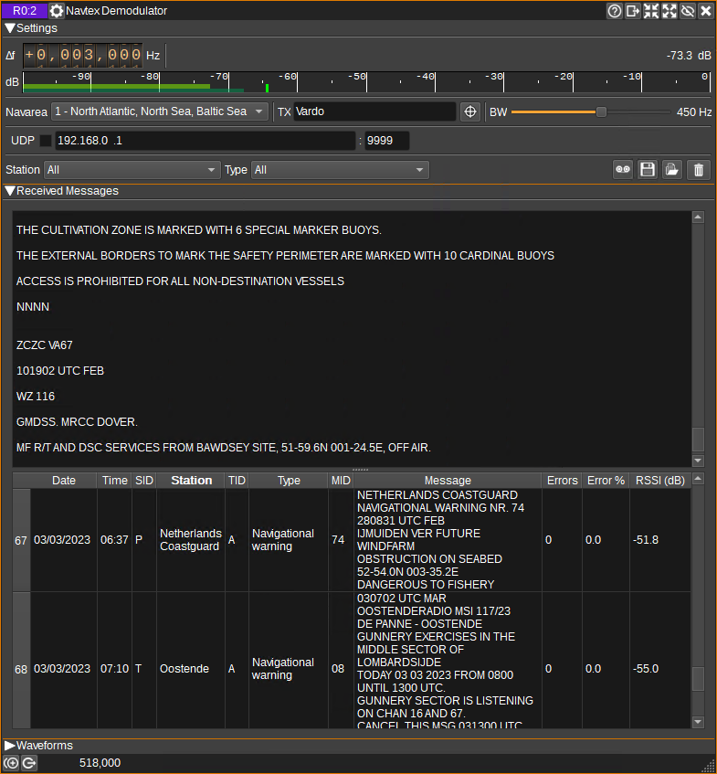

<h1>Navtex Demodulator Plugin</h1>

<h2>Introduction</h2>

This plugin can be used to demodulate Navtex (Navigational Telex) transmissions, which contain marine navigational and meteorological warnings and forecasts.
These are broadcast worldwide on 518kHz (in English for international messages), 490kHz (often in the local language for national messages) and 4209.5kHz.
Navtex messages are transmitted using FSK with 170Hz separation at 100 baud, using [SITOR-B](https://www.itu.int/dms_pubrec/itu-r/rec/m/R-REC-M.625-4-201203-I!!PDF-E.pdf]) encoding.
The [Map](../../feature/map/readme.md) feature can display the location of Navtex transmitters, along with their transmission times and frequencies.

The Navtex demodulator will only attempt to start demodulating data after it detects the phasing signal, that is broadcast before each message.
Therefore, if you enable the demodulator part way through a message, it may take a while before you see any output, even if the signal appears strong,
as the data rate is so low.

<h2>Interface</h2>

The top and bottom bars of the channel window are described [here](../../../sdrgui/channel/readme.md)

<h3>1: Frequency shift from center frequency of reception</h3>

Use the wheels to adjust the frequency shift in Hz from the center frequency of reception. Left click on a digit sets the cursor position at this digit. Right click on a digit sets all digits on the right to zero. This effectively floors value at the digit position. Wheels are moved with the mousewheel while pointing at the wheel or by selecting the wheel with the left mouse click and using the keyboard arrows. Pressing shift simultaneously moves digit by 5 and pressing control moves it by 2.

<h3>2: Channel power</h3>

Average total power in dB relative to a +/- 1.0 amplitude signal received in the pass band.

<h3>3: Level meter in dB</h3>

  - top bar (green): average value
  - bottom bar (blue green): instantaneous peak value
  - tip vertical bar (bright green): peak hold value

<h3>4: Navarea</h3>

Specifies the geographical area in which the receiver is in. This enables the plugin to decode transmitter station identifiers, and display which transmitter the current transmission timeslot is assigned to (5).
Note that with good propagation conditions, it is possible to receive messages from another area, so the station indicated in the message table (17) should be checked against the location given in the received message text.

<h3>5: TX</h3>

Displays which transmitter is assigned the current 10 minute timeslot.

<h3>6: Find TX On Map</h3>

If the [Map](../../feature/map/readme.md) feature is open, when clicked, the Map will be centered on the current transmitter (5).

<h3>7: RF Bandwidth</h3>

This specifies the bandwidth of a filter that is applied to the input signal to limit the RF bandwidth.

<h3>8: UDP</h3>

When checked, received messages are forwarded to the specified UDP address (9) and port (10).

<h3>9: UDP address</h3>

IP address of the host to forward received messages to via UDP.

<h3>10: UDP port</h3>

UDP port number to forward received messages to.

<h3>11: Station Filter</h3>

This drop down displays a list of all stations which messages have been received from. When a station other than "All" is selected, only messages from that station will be displayed in the table.

<h3>12: Message Type Filter</h3>

This drop down displays a list of all message types that have been received. When a type other than "All" is selected, only messages with that type will be displayed in the table.

<h3>13: Start/stop Logging Messages to .csv File</h3>

When checked, writes all received messages to a .csv file, specified by (14).

<h3>14: .csv Log Filename</h3>

Click to specify the name of the .csv file which received messasges are logged to.

<h3>15: Read Data from .csv File</h3>

Click to specify a previously written .csv log file, which is read and used to update the table.

<h3>16: Received Text</h3>

The received text area shows text as it is received.

<h3>17: Received Messages Table</h3>

The received messages table displays the contents of the messages that have been received.

* Date - Date the message was received.
* Time - Time the message was received.
* SID - Station identifier of the transmitting station.
* Station - SID decoded according to the currently selected navarea (4).
* TID - Message type identifier.
* MID - Message identifier.
* Message - The message text.
* Errors - The number of characters that were received with detected errors.
* Error % - The percentage of characters that were received with errors.
* RSSI - Average channel power in dB, while receiving the message.

Right clicking on the header will open a menu allowing you to select which columns are visible, or locate the station in the selected row on the [Map](../../feature/map/readme.md).
To reorder the columns, left click and drag left or right a column header.
Left click on a header to sort the table by the data in that column.

