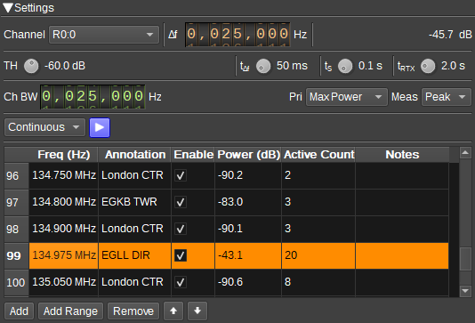

<h1>Frequency Scanner Plugin</h1>

<h2>Introduction</h2>

This plugin can be used to scan a range of frequencies looking for a transmission and then tune another channel (such as an AM or DSD Demod) to that frequency.

<h2>Interface</h2>

The top and bottom bars of the channel window are described [here](../../../sdrgui/channel/readme.md)

<h3>1: Channel</h3>

Specifies the channel (such as an AM, NFM or DSD Demod), by device set and channel index, that should be tuned to the active frequency.

<h3>2: Minimum frequency shift from center frequency of reception for channel</h3>

Use the wheels of keyboard to adjust the minimim frequency shift in Hz from the center frequency of reception for the channel (1).

This setting is typically used to avoid having the channel (1) centered at DC, which can be problematic for some demodulators used with SDRs with a DC spike.

<h3>3: Active frequency power</h3>

Average power in dB relative to a +/- 1.0 amplitude signal received for the active frequency. This is set to '-' while scanning.

<h3>4: TH - Threshold</h3>

Power threshold in dB that determines whether a frequency is active or not.

<h3>5: t_delta_f - Tune time</h3>

Specifies the time in milliseconds that the Frequency Scanner should wait after adjusting the device center frequency, before starting a measurement.
This time should take in to account PLL settle time and the device to host transfer latency, so that the measurement only starts when IQ data
that corresponds to the set frequency is being recieved.

<h3>6: t_s - Scan time</h3>

Specifies the time in seconds that the Frequency Scanner will average its power measurement over.

<h3>7: t_rtx - Retransmission Time</h3>

Specifies the time in seconds that the Frequency Scanner will wait after the power on the active frequency falls below the threshold, before restarting
scanning. This enables the channel to remain tuned to a single frequency while there is a temporary break in transmission.

<h3>8: Ch BW - Channel Bandwidth</h3>

This specifies the bandwidth of the channels to be scanned.

<h3>9: Pri - Priority</h3>

Specifies which frequency will be chosen as the active frequency, when multiple frequencies exceed the threshold (4):

- Max power: The frequency with the highest power will be chosen
- Table order: The frequency first in the frequency table (14) will be chosen.

<h3>10: Meas - Power Measurement</h3>

Specifies how power is measured. In both cases, a FFT is used, with the channel bandwidth being spread over 8 to 32 bins, with the first and last bins being excluded from the measurement (to reduce spectral leakage from adjacent channels):

- Peak: Power is the highest value in all of the bins, averaged over the scan time (6).
- Total: Power is the sum of power in all of the bins, averaged over the scan time (6).
 
Peak can be used when you wish to set the threshold roughly according to the level displayed in the Main Spectrum.
Total is potentially more useful for wideband signals, that are close to the noise floor.

<h3>11: Run Mode</h3>

Specifies the run mode:

- Single: All frequencies are scanned once. Channel (1) is tuned to the active frequency at the end of the scan. The scan does not repeat.
- Continuous: All frequencies scanned, with channel (1) being tuned to active frequency at the end of the scan. Scan repeats once the power on the active frequency falls below the threshold (4) for longer than the retransmission time (7).
- Scan only: All frequencies are scanned repeatedly. The channel will not be tuned. This mode is just for counting how often frequencies are active, which can be seen in the Active Count column in the frequency table (14).

<h3>12: Start/Stop Scanning</h3>

Press this button to start or stop scanning.

<h3>13: Status Text</h3>

Displays the current status of the Frequency Scanner.

- "Scanning": When scanning for active frequencies.
- Frequency and annotation for active frequency.

<h3>14: Frequency Table</h3>

The frequency table contains the list of frequencies to be scanned, along with results of a scan. The columns are:

- Freq (Hz): Specifies the channel center frequencies to be scanned. These should be spaced by integer multiples of the channel bandwidth (8). Values should be entered in Hertz.
- Annotation: An annotation (description) for the frequency, that is obtained from the closest matching [annotation marker](../../../sdrgui/gui/spectrummarkers.md) in the Main Spectrum.
- Enable: Determines whether the frequency will be scanned. This can be used to temporaily disable frequencies you aren't interested in.
- Power (dB): Displays the measured power in decibels from the last scan. The cell will have a green background if the power was above the threshold (4).
- Active Count: Displays the number of scans in which the power for this frequency was above the threshold (4). This allows you to see which frequencies are commonly in use.
- Notes: Available for user-entry of notes/information about this frequency.

When an active frequency is found after a scan, the corresponding row in the table will be selected.

Right clicking on a cell will display a popup menu:

- Copy contents of cell to clipboard.
- Tune selected channel (1) to the frequency in the row clicked on.

<h3>15: Add</h3>

Press to add a single row to the frequency table (14).

<h3>16: Add Range</h3>

Press to add a range of frequencies to the frequency table (14). A dialog is displayed with start and stop frequencies, as well as a step value.
The step value should typically be an integer multiple of the channel bandwidth (8).

<h3>17: Remove</h3>

Removes the selected rows from the frequency table (14).

<h3>18: Up</h3>

Moves the selected rows up the frequency table (14).

<h3>19: Down</h3>

Moves the selected rows the the frequency table (14).

<h3>20: Clear Active Count</h3>

Press to reset the value in the Active Count column to 0 for all rows.
