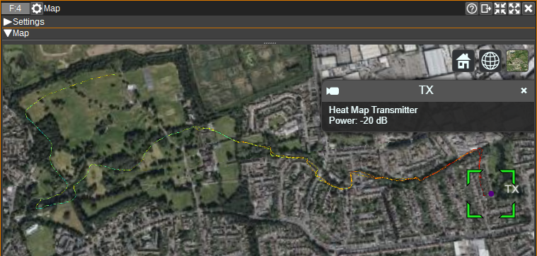
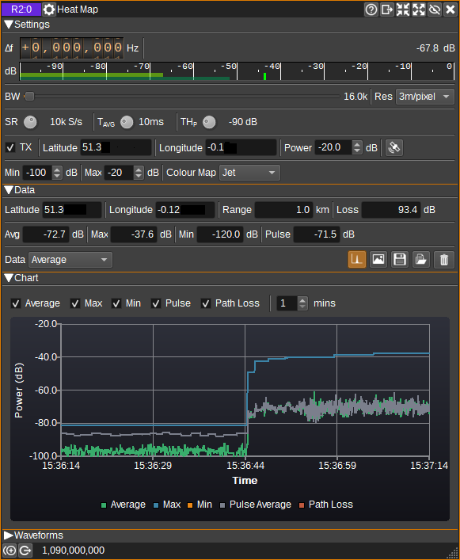

<h1>Heat Map plugin</h1>

<h2>Introduction</h2>

This plugin can be used to generate a heat map based on RF channel power. Channel power is measured as average power, maximum peak power, minimum peak power as well as pulse average power (i.e. average power above a threshold).

To view the Heat Map visually, the [Map Feature](../../feature/map/readme.md) should be opened. If using the 3D map, it is recommended to set the Terrain to Ellisoid (as the heat map is 2D).

To record data for a heat map, a GPS is required, and Preferences > My Position should have "Auto-update from GPS" enabled.

On Windows/Linux/Mac, a GPS supporting NMEA via a serial port at 4800 baud is required.
The COM port / serial device should be specified via the QT_NMEA_SERIAL_PORT environment variable before SDRangel is started.
(E.g. on Linux: export QT_NMEA_SERIAL_PORT=/dev/ttyACM0 or /dev/ttyUSB0 on Windows: Set QT_NMEA_SERIAL_PORT=COM5 via Control Panel)
This requires the Qt serialnmea plugin, which is not available in the libqt5positioning5-plugins package on Debian / Ubuntu.
It can be downloaded for Ubuntu/x64 from http://sdrangel.org/downloads/libqtposition_serialnmea.so and should be installed in usr/lib/x86_64-linux-gnu/qt5/plugins/position/.
This custom build of the plugin also allows setting the baud rate via the QT_NMEA_SERIAL_BAUD_RATE option (which is not supported on Windows nor Mac).

On Android, GPS setup should be automatic. GPS position updates may stop on Android when the screen is off. To keep the screen on, press the View > Keep Screen On menu.

<h2>Interface</h2>

The top and bottom bars of the channel window are described [here](../../../sdrgui/channel/readme.md)

<h3>1: Frequency shift from center frequency of reception</h3>

Use the wheels to adjust the frequency shift in Hz from the center frequency of reception. Left click on a digit sets the cursor position at this digit. Right click on a digit sets all digits on the right to zero. This effectively floors value at the digit position. Wheels are moved with the mousewheel while pointing at the wheel or by selecting the wheel with the left mouse click and using the keyboard arrows. Pressing shift simultaneously moves digit by 5 and pressing control moves it by 2.

<h3>2: Channel power</h3>

Average total power in dB relative to a +/- 1.0 amplitude signal received in the pass band.

<h3>3: Level meter in dB</h3>

  - top bar (green): average value
  - bottom bar (blue green): instantaneous peak value
  - tip vertical bar (bright green): peak hold value

<h3>4: BW - RF Bandwidth</h3>

Bandwidth in Hz of the channel for which power is to be measured.

<h3>5: Res - Resolution</h3>

Displays the heat map resolution in metres per pixel. Currently this is fixed at ~3m per pixel.

<h3>6: SR - Sample Rate</h3>

Sets the sample rate at which channel power is sampled and measured. Values range from 100S/s to 10MS/s in powers of 10.

<h3>7: Tavg - Average Time</h3>

Time period overwhich the channel power is averaged. Values range from 10us to 10s in powers of 10. The available values depend upon the sample rate.

<h3>8: THp - Pulse Threshold</h3>

The pulse threshold sets the power in dB for which the channel power needs to exceed, in order to be included in the pulse average power measurement.

<h3>9: TX - Enable Transmitter</h3>

When checked, enables the position of the transmitter of the signal being mapped to be set and its transmit power level. This enables range and path loss calculations.

<h3>10: Transmitter Latitude</h3>

Specifies the latitude of the transmitter in decimal degrees, North positive.

<h3>11: Transmitter Longitude</h3>

Specifies the longitude of the transmitter in decimal degrees, East positive.

<h3>12: Transmitter Power</h3>

Specifies the power of the transmitter in dB.

<h3>13: Set Transmitter Position</h3>

When clicked, sets the transmitter position (10, 11) to the current position.

<h3>14: Min - Colour Map Mininimum Power</h3>

The colour map minimum power field, specifies the power in dB, below which, power measurements are not plotted on the heat map, and above which are plotted using the colour map (16).

<h3>15: Max - Colour Map Maximum Power</h3>

The colour map maximum power field, specifies the power in dB, above which, all power measurements are mapped to the highest entry in the colour map (16).

<h3>16: Colour Map</h3>

Selects the colour map used to linearly map power measurements between the minimum (14) and maximum (15) fields to the colour of pixels that will be plotted on the map.

<h3>17: Latitude</h3>

Displays current latitude in decimal degrees. North positive.

<h3>18: Longitude</h3>

Displays current longitude in decimal degrees. East positive.

<h3>19: Range</h3>

Displays the range from the current position to the transmitter position in metres or kilometres.

<h3>20: Loss</h3>

Displays the free space path loss from the current position to the transmitter, based on the channel centre frequency, in dB.

<h3>21: Avg - Average Power</h3>

Displays the most recent average power measurement in dB.

<h3>22: Max - Max Peak Power</h3>

Displays the current maximum peak power measurement in dB.

<h3>23: Min - Min Peak Power</h3>

Displays the current minimum peak power measurement in dB.

<h3>24: Pulse - Pulse Average Power</h3>

Displays the most recent pulse average power measurement in dB.

<h3>25: Data</h3>

Selects which power data should be plotted on the map, and also which data will be saved (26, 27) or read (28).

<h3>26: Display Chart</h3>

Toggles whether the chart (31) is displayed.

<h3>27: Save to image</h3>

Saves the heat map power data selected by (25) to an image file.

<h3>28: Save to CSV file</h3>

Saves the heat map power data selected by (25) to a CSV file.

<h3>29: Read from CSV file</h3>

Reads a heat map from a CSV file.

<h3>30: Clear Heat Map</h3>

Clears all heat map power data.

<h3>31: Chart</h3>

The chart displays the most recent average, max peak, min peak and pulse average measurements as well as an estimated
received signal level from the transmitter (9), taking in to account free space path loss.

Each series can be individually enabled or disabled.
The last number of minutes worth of data displayed can be specified from 1 to 10 minutes.

<h2>Power Measurements</h2>

The following figure shows the difference between average power, max peak power, min peak power and pulse average power, when the averaging time is over the full time of the graph.

The 'Path loss' map displays free space path loss based on the range to the transmitter (10, 11) and centre frequency.

