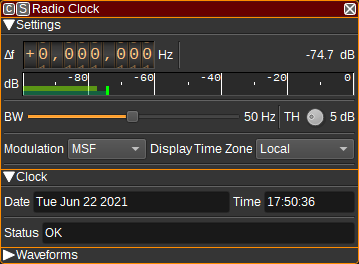
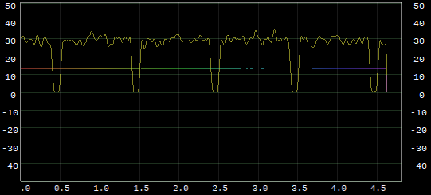

<h1>Radio Clock Plugin</h1>

<h2>Introduction</h2>

This plugin can be used to receive the time and date as broadcast on Low Frequency (LF) by various transmitters that are tied to atomic clocks:

* [MSF](https://en.wikipedia.org/wiki/Time_from_NPL_(MSF)) - UK - 60kHz
* [DCF77](https://en.wikipedia.org/wiki/DCF77) - Germany - 77.5kHz
* [TDF](https://en.wikipedia.org/wiki/TDF_time_signal) - France - 162kHz
* [WWVB](https://en.wikipedia.org/wiki/WWVB) - USA - 60kHz
* [JJY](https://en.wikipedia.org/wiki/JJY) - Japan - 40kHz

If you'd like other transmitters to be supported, please upload a .sdriq file to SDRangel's [github issue tracker](https://github.com/f4exb/sdrangel/issues).

Typically, it will take two minutes before the time is able to be displayed (up to one minute to find the minute marker, then another minute to receive the timecode).

Although the atomic clocks used to transmit the timecode are extremely accurate, propagation, SDR data transfer and demodulation delays limit accuracy of the displayed time to around 1 second.

<h2>Interface</h2>

The top and bottom bars of the channel window are described [here](../../../sdrgui/channel/readme.md)

<h3>1: Channel frequency entry mode</h3>

Select from one of the following modes to determine how the channel center frequency is calculated:

* Δf - Specify an offset in Hz from device center frequency.
* f - Specific a frequency in Hz.

<h3>2: Channel Frequency</h3>

Specifies channel center frequency according to frequency entry mode (1):

* Δf - Offset in Hz from device center frequency.
* f - Absolute frequency in Hz.

<h3>3: Channel power</h3>

Average total power in dB relative to a +/- 1.0 amplitude signal received in the pass band.

<h3>4: Level meter in dB</h3>

  - top bar (green): average value
  - bottom bar (blue green): instantaneous peak value
  - tip vertical bar (bright green): peak hold value

<h3>5: BW - RF Bandwidth</h3>

This specifies the bandwidth of a LPF that is applied to the input signal to limit the RF bandwidth.

<h3>6: TH - Threshold</h3>

For MSF, DCF77, WWVB and JJY, specifies the threshold in dB below the average carrier power level that determines a binary 0 or 1.

<h3>7: Modulation</h3>

Specifies the modulation and timecode encoding used:

* MSF - OOK (On-off keying)
* DCF77 - OOK (On-off keying)
* TDF - PM (Phase modulation)
* WWVB - OOK (On-off keying)
* JJY - OOK (On-off keying)

<h3>8: Display Time Zone</h3>

Specifies the time zone used to display the received time. This can be:

* Broadcast - the time is displayed as broadcast (which is typically the time zone of the country the signal is broadcast from, adjusted for summer time. WWVB broadcasts UTC).
* Local - the time is converted to the local time (as determined by your operating system's time zone).
* UTC - the time is converted to Coordinated Universal Time.

<h3>9: Date</h3>

Displays the decoded date.

<h3>10: Time</h3>

Displays the decoded time, adjusted for the time zone set by (8).

<h3>11: Status</h3>

Displays the demodulator status. This can be:

* Looking for minute marker - Indicated at startup or after signal lost, while looking for the minute marker.
* Got minute marker - Indicated after finding the minute marker and waiting for the first timecode to be received.
* OK - Indicates timecodes are being received.
* Parity error - Indicates a parity error in received timecode.

The date and time fields are only valid when the status indicates OK.

If while in the OK state several second markers are not detected, the status will return to Looking for minute marker.

<h3>12: Daylight Savings</h3>

Displays the daylight savings state:

* In effect
* Not in effect
* Starting
* Ending

For MSF, DCF77 and TDF, starting/ending is indicated one hour before the change. For WWVB it is set for the whole day. Japan does not use daylight savings.

<h3>Waveforms</h3>

The scope shows how various variables within the demodulator vary with time. These can be used to help debug operation of the demodulator.

The signals available include:

- IQ - IQ data at channel sample rate (1kHz).
- MagSq - Magnitude squared (power) of received signal after being filtered with a moving average filter.
- TH - Current threshold, which is moving average of MagSq - TH setting.
- FM - Output of FM demodulator for TDF demodulator only.
- Data - Demodulated data. For MSF/DCF77, this data=MagSq>TH.
- Samp - Indicates when data is sampled (either for the second marker or for a timecode data bit).
- GotMM - Indicates whether the minute marker has been received. Cleared when synchronization to second marker is lost.
- GotM - Indicates when a marker is detected. For WWVB only.

As an example of how this can be used, we can plot the MagSq as X and the calculated TH as Y, which can help to set the value of the
TH setting to an appropriate level.

