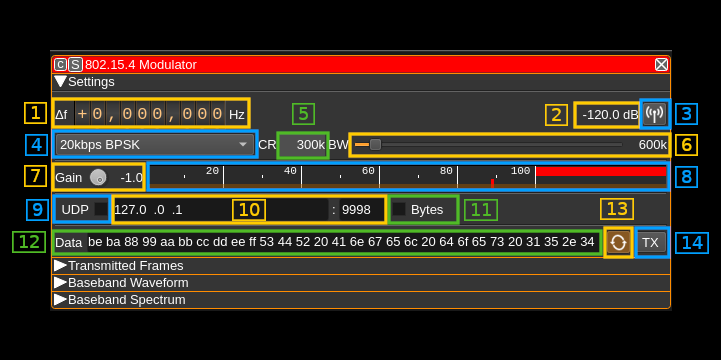

<h1>IEEE 802.15.4 modulator plugin</h1>

<h2>Introduction</h2>

This plugin can be used to transmit IEEE 802.15.4 frames. The 802.15.4 PHY & RF layers are used by networking layers such as ZigBee, 6LoWPAN and others.

<h2>Interface</h2>

<h3>1: Frequency shift from center frequency of transmission</h3>

Use the wheels to adjust the frequency shift in Hz from the center frequency of transmission. Left click on a digit sets the cursor position at this digit. Right click on a digit sets all digits on the right to zero. This effectively floors value at the digit position. Wheels are moved with the mousewheel while pointing at the wheel or by selecting the wheel with the left mouse click and using the keyboard arrows. Pressing shift simultaneously moves digit by 5 and pressing control moves it by 2.

<h3>2: Channel power</h3>

Average total power in dB relative to a +/- 1.0 amplitude signal generated in the pass band.

<h3>3: Channel mute</h3>

Use this button to toggle mute for this channel.

<h3>4: PHY</h3>

This specifies the parameters of the PHY (physical layer), including the bit rate and modulation that is used for the frame transmission. Supported PHYs are 20kbps BPSK, 40kbps BPSK, 100kpbs <1GHZ O-QPSK, 250kpbs <1GHz O-QPSK and 250kbps 2.4GHz O-QPSK.
These 802.15.4 PHYs use DSSS (Direct sequence spread spectrum), whereby multiple chips are transmitted per symbol. This means that a high baseband sample rate and large RF bandwidth is required. The baseband sample rate should be set to an integer multiple of the chip rate (at least 4x).
Each PHY is applicable only for specific frequency bands as detailed below:

Channel Page | Channels | Frequencies (MHz)  | Bit rate (kbps) | Chip rate (kcps) | Modulation | Shaping | Min sample rate (MSa/s)
-------------|----------|--------------------|-----------------|------------------|------------|---------|------------------------
0            | 0        | 868.3              | 20              | 300              | BPSK       | RC r=1  | 1.2
0            | 1-10     | 906, 908... 926    | 40              | 600              | BPSK       | RC r=1  | 2.4
0            | 11-26    | 2405, 2410... 2480 | 250             | 2000             | O-QPSK     | Sine    | 8
2            | 0        | 868.3              | 100             | 400              | O-QPSK     | Sine/RC | 2.4
2            | 1-10     | 906, 908... 926    | 250             | 1000             | O-QPSK     | Sine    | 4
5            | 0-3      | 780, 782... 786    | 250             | 1000             | O-QPSK     | RC r=.8 | 4
11           | 0-6      | 2363, 2368... 2393 | 250             | 2000             | O-QPSK     | Sine    | 8
11           | 7-13     | 2367, 2372... 2397 | 250             | 2000             | O-QPSK     | Sine    | 8
11           | 14       | 2395               | 250             | 2000             | O-QPSK     | Sine    | 8

<h3>5: Chip rate</h3>

This is the chip rate. It must be a multiple of the baseband sample rate and the baseband sample rate should be at least twice the chip rate. If one or both of these conditions are not met the background turns to red and the tooltip details the condition.

<h3>6: RF Bandwidth</h3>

This specifies the bandwidth of a LPF that is applied to the output signal to limit the RF bandwidth.

PHY                         | Occupied BW (99%)
----------------------------|-------------------
20kbps BPSK                 | 400kHz
40kbps BPSK                 | 760kHz
100kbps O-QPSK              | 330kHz
250kbps <1GHz O-QPSK (Sine) | 1.2MHz
250kbps <1GHz O-QPSK (RC)   | 1.2MHz
250kbps >2GHz O-QPSK        | 2.6MHz

<h3>7: Gain</h3>

Adjusts the gain in dB from -60 to 0dB. The gain should be set to ensure the level meter remains below 100% (see 8). If the baseband signal clips, this can lead to out-of-band spurious.

<h3>8: Level meter in %</h3>

  - top bar (beige): average value
  - bottom bar (brown): instantaneous peak value
  - tip vertical bar (bright red): peak hold value

<h3>9: UDP input</h3>

Check to get data from UDP

<h3>10: UDP address and port</h3>

This UDP data packets listening address and port

<h3>11: Get data in bytes format</h3>

Check this if the data received is in bytes. When not checked data is expected in string format as blank separated hex bytes same as data below (12))

<h3>12: Data</h3>

The frame of data to send as hex bytes. For example, to send a MAC ACK frame, enter "02 00 00". The MAC CRC should not be included, as this is calculated and appended automatically.

In the diagram below this is the blue part without the "frame check sequence". Thus its maximum length is 125 bytes.

<h3>13: Repeat</h3>

Check this button to repeatedly transmit a frame. Right click to open the dialog to adjust the delay between retransmission and number of times the frame should be repeated.

<h3>14: TX</h3>

Transmits a frame containing the payload set in the data field.

<h2>API</h2>

Full details of the API can be found in the Swagger documentation.

To transmit stored data just send a "tx" action:

    curl -X POST "http://127.0.0.1:8091/sdrangel/deviceset/1/channel/0/actions" -d '{"channelType": "IEEE_802_15_4_Mod",  "direction": 1, "IEEE_802_15_4_ModActions": { "tx": 1}}

To transmit a frame from the command line:

    curl -X POST "http://127.0.0.1:8091/sdrangel/deviceset/1/channel/0/actions" -d '{"channelType": "IEEE_802_15_4_Mod",  "direction": 1, "IEEE_802_15_4_ModActions": { "tx": 1, "data": "02 00 00" }}'

To set the PHY to 20kbps BPSK:

    curl -X PATCH "http://127.0.0.1:8091/sdrangel/deviceset/1/channel/0/settings" -d '{"channelType": "IEEE_802_15_4_Mod", "direction": 1, "IEEE_802_15_4_ModSettings": {"beta": 1, "bitRate": 20000,
    "modulation': 0, "pulseShaping": 0, "rfBandwidth": 400000, "subGHzBand": 1 }}'
