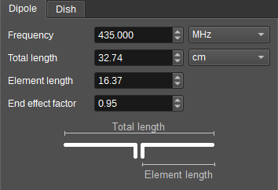
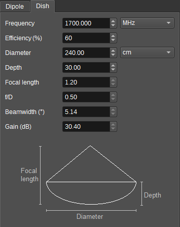

<h1>Antenna Tools Feature Plugin</h1>

<h2>Introduction</h2>

The Antenna Tools feature has a couple of calculators to help with antenna design and tuning.

* A dipole calculator, for calculating the length of a half wave dipole for a given frequency.
* A parabolic dish calculator, for calculating focal length for a dish with a given diameter and depth, as well as corresponding gain and beamwidth for a given frequency.

Each calculator is contained within an individual tab. Settings in one tab do not effect calculations in other tabs.

<h2>Half Wave Dipole Calculator</h2>

<h3>1: Frequency</h3>

When entering a frequency in MHz in this field, the calculator will calculate the total and element length for a half wave dipole at this frequency.

When a length is entered in (3) or (5), this field will display the corresponding resonant frequency.

<h3>2: Frequency Select</h3>

Select how the frequency is chosen:

* MHz - A frequency can be manually entered in (1) in MHz.
* Device set N - The frequency automatically tracks the centre frequency of Device Set N.

<h3>3: Dipole Total Length</h3>

This field displays the total length of a half wave dipole corresponding to the frequency entered in (1) or element length (5).

When a length is entered in this field, the calculator will calculate the corresponding frequency (1) and element length (5).

The dipole length is calculated as: l=0.5\*k\*c/f

<h3>4: Dipole Length Units</h3>

This field selects the units lengths are entered and displayed in. This can be:

* cm - centimetres.
* m - metres.
* feet - feet.

<h3>5: Dipole Element Length</h3>

This field displays the element length of each dipole for a half wave dipole corresponding to the frequency entered in (1) or total length (3).

When a length is entered in this field, the calculator will calculate the corresponding frequency (1) and total length (3).

<h3>6: End Effect Factor</h3>

A half wave dipole in free space with total length being half the wavelength of operation has a reactance of 43 Ohms.

To eliminate this reactance, the dipole should be shortened. The amount it needs to be shortened by depends upon the ratio of the diameter of the dipole to wavelength,
with factors ranging from 0.98 for a thin dipole (0.00001 wavelengths) to 0.94 (thickness of 0.008 wavelengths) with a commonly used value of 0.95.

The calculator doesn't use an analytical formula for this, as the reactance also depends on the enviroment (such as distance to ground), so some experimentation
is needed in finding the true value.

<h2>Parabolic Dish Calculator</h2>

<h3>7: Frequency</h3>

When entering a frequency in MHz in this field, the calculator will calculate the beamwidth (15) and gain (16) for a dish of the given dimensions (10 & 11) at the entered frequency.

<h3>8: Frequency Select</h3>

Select how the frequency is chosen:

* MHz - A frequency can be manually entered in (7) in MHz.
* Device set N - The frequency automatically tracks the centre frequency of Device Set N.

<h3>9: Efficiency</h3>

Specifies the efficiency of the dish in %. When entered, the calculator will calculate the gain (16), according to the entered frequency (7) and dimensions (10 & 11).

This value should include losses for things like spillover, illumination loss, feed and support blockage, focus errors.

<h3>10: Surface Error</h3>

Specifies the RMS surface error of the dish in length units (as determined by (12)).

<h3>11: Diameter</h3>

When entering the diameter of the dish, the calculator will calculate the focal length (14), f/D ratio (15), beamwidth (16) and gain (17).

<h3>12: Dish Length Units</h3>

This field selects the units lengths are entered and displayed in. This can be:

* cm - centimetres.
* m - metres.
* feet - feet.

<h3>13: Depth</h3>

When entering the depth of the dish, the calculator will calculate the focal length (14) and f/D ratio (15).

<h3>14: Focal length</h3>

Displays the calculated focal length.

Focal length is calculated as: f=d^2/(16*D)

<h3>15: f/D Ratio</h3>

Displays the calculated focal length to diameter ratio.

<h3>16: Beamwidth</h3>

Displays the halfpower (-3dB) beamwidth in degrees.

Beamwidth is calculated as: pi/180*1.15*lambda/D.

Note that the constant 1.15 is dependent upon illumination tapering, which is determined by the feed.

<h3>17: Gain</h3>

Displays the calculated gain in dB.

The nominal gain is calculated as: g0=10\*log10(eff/100.0\*(pi*D/lambda)^2)

The gain is then adjusted for surface error with Ruze's equation: g=g0-685.81*(e/lambda)^2

<h3>18: Effective area</h3>

Displays the effective area in m^2.

Aeff is calculated as: g*lambda^2/(4*pi)
