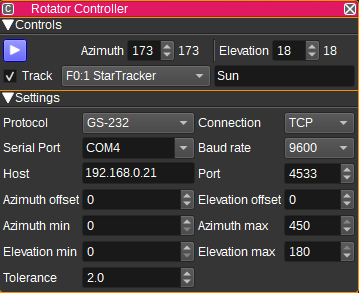

<h1>GS-232 Rotator Controller Feature Plugin</h1>

<h2>Introduction</h2>

The GS-232 Rotator Controller feature plugin allows SDRangel to send commands to GS-232 rotators. This allows SDRangel to point antennas mounted on a rotator to a specified azimuth and elevation.

Azimuth and elevation can be set manually by a user in the GUI, via the REST API, or via another plugin, such as the ADS-B Demodulator, which can track a selected aircraft.

<h2>Interface</h2>

<h3>1: Start/Stop plugin</h3>

This button starts or stops the plugin. When the plugin is stopped, azimuth and elevation commands will not be sent to the GS-232 rotator.

<h3>2: Azimuth</h3>

Specifies the target azimuth (angle in degrees, clockwise from North) to point the antenna towards. Valid values range from 0 to 450 degrees. The value to the right of the target azimuth, is the current azimuth read from the GS-232 rotator.

<h3>3: Elevation</h3>

Specifies the target elevation (angle in degrees) to point the antenna towards. Valid values range from 0 to 180 degrees, where 0 and 180 point towards the horizon and 90 degrees to zenith. The value to the right of the target elevation, is the current elevation read from the GS-232 rotator.

<h3>4: Serial Port</h3>

Specifies the serial port (E.g. COM3 on Windows or /dev/ttyS0 on Linux) that will be used to send commands to the GS-232 rotator.

<h3>5: Baud rate</h3>

Specifies the baud rate that will be used to send commands to the GS-232 rotator. Typically this is 9600.

<h3>6: Track</h3>

When checked, the GS-232 Rotator Controller plugin will query the channel specified by the Device (8) and Channel (9) combo boxes for the target azimuth and elevation. For example, this allows an aircraft to be tracked, by setting the Device and Channel to correspond to the ADS-B Demodulator plugin.  

<h3>7: Refresh list of devices and channels</h3>

Use this button to refresh the list of devices (8) and channels (9)

<h3>8: Select device set</h3>

Specify the SDRangel device set containing the channel plugin that will be asked for aziumth and elevation values. Defaults to R0.

<h3>9: Select channel</h3>

The channel index specifies the SDRangel channel that will be asked for azimuth and elevation values. Defaults to 0.

<h2>Developer Information</h2>

For a channel plugin to be able to set the azimuth and elevation, its channel report should contain targetAzimuth and targetElevation. See the ADS-B plugin as an example.
 