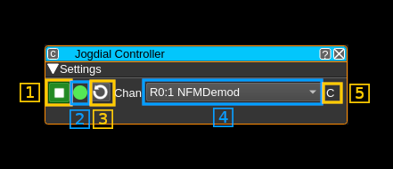
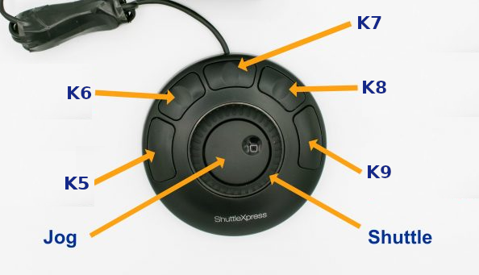
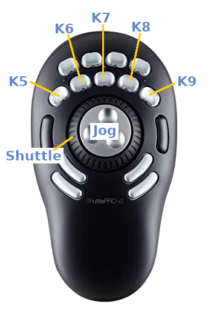

<h1>Jogdial Controller Feature Plugin</h1>

<h2>Introduction</h2>

This plugin aims at supporting frequency control via a "jog dial". A jog dial, jog wheel, shuttle dial, or shuttle wheel is a type of knob, ring, wheel, or dial which allows the user to shuttle or jog through audio or video media.

It is designed to support the Contour ShuttleXpress and ShuttlePro products but as it is keyboard keys based any device capable of reproducing the same key sequences (including a standard keyboard - see next) can interact with this plugin.

In the last section you will find details about the key sequences and placement of supported knobs on the ShuttleXpress and ShuttlePro.

Note that it is based on Qt keyboard events. These events are supported only for GUI applications therefore this plugin is not built in the server variant.

<h2>Interface</h2>



<h3>1: Start/Stop</h3>

Use this toggle to activate or deactivate the plugin. Note that for the control to be effective the plugin should also have the focus. You can check the focus state with the focus indicator (2)

<h3>2: Focus indicator</h3>

This indicator turns green if the plugin has focus. To set the focus on the plugin just click anywhere on it. The controls are effective only if the plugin has focus.

<h3>3: Refresh channels list</h3>

Use this button to refresh the list of available channels. It will scan through all the device sets presents in the instance to list their channels in the combo box next (4).

Note that on first start the list in (4) is empty therefore you must press this button right after the plugin is started with (1)

<h3>4: Select channel</h3>

Use this combo box to select which channel to control. The list item is formatted this way:

  - R ot T for a source (Rx) or sink (Tx) device set
  - The sequence number of the device set
  - The sequence number of the channel after the semicolon separator
  - The type of channel

The frequency of the device of the device set the channel belongs to can also be controlled when device control is selected. The type of control is displayed in (5)

To select the type of control:

  - Press K5 on the Contour device or ¨D" (shift+D) on the keyboard for device control
  - Press K9 on the Contour device or ¨C" (shift+C) on the keyboard for channel control

<h3>5: Control type indicator</h3>

It displays "D" when in device control or "C" when in channel control mode.

<h2>Contour products and keyboard control</h2>

<h3>Contour devices</h3>

The Controur devices generally have a central "jog" wheel inside a spring loaded ring called the "shuttle" wheel plus a series of buttons.

<b>ShuttleXpress layout</b>



<b>ShuttlePRO layout</b>



The **jog wheel** is used to go up and down in discrete frequency units. You can use the Ctl and Shift keys on the keyboard simultaneously to select the frequency step:

  - No key: &plusmn; 1 Hz for channels &plusmn; 1 kHz for devices
  - Ctl key: &plusmn; 10 Hz for channels &plusmn; 10 kHz for devices
  - Shift key: &plusmn; 100 Hz for channels &plusmn; 100 kHz for devices
  - Ctl+Shift key: &plusmn; 1 kHz for channels &plusmn; 1 MHz for devices


The **shuttle wheel** has a central rest position and 7 positions on the left and 7 on the right. The left positions are used to go down in frequency and the right positions to go up. The frequency increments or decrements are sent every 100 ms as long as the shuttle position is maintained. It stops at rest (central) position. The further you go from the center the larger the frequency increment or decrement at each step. The amount is multiplied by 10 from one position to the next as you move away from the center. Thus to summarize:

  - Center: rest position stops moving
  - &plusmn; 1 step: moves &plusmn; 1 unit (1 Hz for channels, 1 kHz for devices)
  - &plusmn; 2 steps: moves &plusmn; 10 units
  - &plusmn; 3 steps: moves &plusmn; 100 units
  - &plusmn; 4 steps: moves &plusmn; 1000 units (1 kHz for channels, 1 MHz for devices)
  - &plusmn; 5 steps: moves &plusmn; 10000 units
  - &plusmn; 6 steps: moves &plusmn; 100000 units
  - &plusmn; 7 steps: moves &plusmn; 1000000 units (1 MHz for channels, 1 GHz for devices)

The **keys** are mapped as follows:

  - K5: Select device control
  - K6: Move down through the list of available channels
  - K7: Reset the channel frequency (set to 0) - useful when you loose the channel out of the baseband window
  - K8: Move up through the list of available channels
  - K9: Select channel control

<h3>Mapping to keyboard and keyboard control</h3>

The contour devices proceed by mapping their events to keyboard events and this makes them very adaptable. The Jogdial Controller feature is keyboard event based so you may as well use your keyboard for control. In that case for better visual mapping it is recommended to use a US or US International keyboard.

Contour provides software to perform the mapping on Windows. So when running on Windows please refer to Contour documentation to implement the keyboard sequence mapping that is described next.

When running on Linux ou may use [ShuttlePRO](https://github.com/nanosyzygy/ShuttlePRO) for keyboard mapping. It will work also for the ShuttleXpress with minor changes. You will have to identify the path of the Shuttle device and run the program against it in a terminal. See the last section for details.

<h4>Keyboard mapping</h4>

The shuttle devices controls are mapped according to the following table. K5 to K9 represent the shuttle keys. S-7 to S7 represent the shuttle (outer ring) positions S0 being the rest middle position. JL is a jog step to the left and JR a jog step to the right:

<table>
  <tr>
    <th>Shuttle</th>
    <th>Keyboard</th>
    <th>Key sequence (US)</th>
    <th>Action</th>
  </tr>
  <tr>
    <td>K5</td>
    <td>D</td>
    <td>Shift+D</td>
    <td>Device control</td>
  <tr>
  <tr>
    <td>K6</td>
    <td>&larr;</td>
    <td>&larr;</td>
    <td>Select previous channel in list</td>
  <tr>
  <tr>
    <td>K7</td>
    <td>Home</td>
    <td>Home</td>
    <td>Reset channel frequency (set to 0)</td>
  <tr>
  <tr>
    <td>K8</td>
    <td>&rarr;</td>
    <td>&rarr;</td>
    <td>Select next channel in list</td>
  <tr>
  <tr>
    <td>K9</td>
    <td>C</td>
    <td>Shift+C</td>
    <td>Channel control</td>
  <tr>
  <tr>
    <td>S-7</td>
    <td>&amp;</td>
    <td>Shift+7</td>
    <td>Continuous -1 MHz / -1 GHz move</td>
  <tr>
  <tr>
    <td>S-6</td>
    <td>&Hat;</td>
    <td>Shift+6</td>
    <td>Continuous -100 kHz / -100 MHz move</td>
  <tr>
  <tr>
    <td>S-5</td>
    <td>&percnt;</td>
    <td>Shift+5</td>
    <td>Continuous -10 kHz / -10 MHz move</td>
  <tr>
  <tr>
    <td>S-4</td>
    <td>&dollar;</td>
    <td>Shift+4</td>
    <td>Continuous -1 kHz / -1 MHz move</td>
  <tr>
  <tr>
    <td>S-3</td>
    <td>#</td>
    <td>Shift+3</td>
    <td>Continuous -100 Hz / -100 kHz move</td>
  <tr>
  <tr>
    <td>S-2</td>
    <td>&commat;</td>
    <td>Shift+2</td>
    <td>Continuous -10 Hz / -10 kHz move</td>
  <tr>
  <tr>
    <td>S-1</td>
    <td>&excl;</td>
    <td>Shift+1</td>
    <td>Continuous -1 Hz / -1 kHz move</td>
  <tr>
  <tr>
    <td>S0</td>
    <td>0</td>
    <td>0</td>
    <td>Stop continuous move</td>
  <tr>
  <tr>
    <td>S1</td>
    <td>1</td>
    <td>1</td>
    <td>Continuous +1 Hz / +1 kHz move</td>
  <tr>
  <tr>
    <td>S2</td>
    <td>2</td>
    <td>2</td>
    <td>Continuous +10 Hz / +10 kHz move</td>
  <tr>
  <tr>
    <td>S3</td>
    <td>3</td>
    <td>3</td>
    <td>Continuous +100 Hz / +100 kHz move</td>
  <tr>
  <tr>
    <td>S4</td>
    <td>4</td>
    <td>4</td>
    <td>Continuous +1 kHz / +1 MHz move</td>
  <tr>
  <tr>
    <td>S5</td>
    <td>5</td>
    <td>5</td>
    <td>Continuous +10 kHz / +10 MHz move</td>
  <tr>
  <tr>
    <td>S6</td>
    <td>6</td>
    <td>6</td>
    <td>Continuous +100 kHz / +100 MHz move</td>
  <tr>
  <tr>
    <td>S7</td>
    <td>7</td>
    <td>7</td>
    <td>Continuous +1 MHz / +1 GHz move</td>
<tr>
  <tr>
    <td>JL</td>
    <td>&darr;</td>
    <td>&darr;</td>
    <td>Single -1/-10/-100/-1000 (Hz/kHz) move</td>
  <tr>
  <tr>
    <td>JR</td>
    <td>&uarr;</td>
    <td>&uarr;</td>
    <td>Single +1/+10/+100/+1000 (Hz/kHz) move</td>
  <tr>
</table>

<h4>US keyboard mapping</h4>


<h3>Running the Contour devices in Linux</h3>

As briefly introduced earlier you may use [ShuttlePRO](https://github.com/nanosyzygy/ShuttlePRO) for keyboard mapping.

The program will normally work as-is for ShuttlePRO. It will also work for ShuttleXpress with a few adaptations detailed next.

Firstly you need to add the proper udev rules that are slightly different. In fact you just need to change the "ATTR" line by:
```
ATTRS{name}=="Contour Design ShuttleXpress" MODE="0644"
```
Secondly the device path is different for ShuttleXPress. You have to look for your device in the path starting with `/dev/input/by-id/usb-Contour_Design_` In most cases this will be: `/dev/input/by-id/usb-Contour_Design_ShuttleXpress-event-if00`

You will then use this path as argument to the `shuttlepro` program:

`shuttlepro /dev/input/by-id/usb-Contour_Design_ShuttleXpress-event-if00`

You may change the argument in the `shuttle` script for convenience:

`exec shuttlepro /dev/input/by-id/usb-Contour_Design_ShuttleXpress-event-if00`

In any case you need to specify the mapping in the `~/.shuttlerc` file by adding a section for SDRangel like this:
```
[SDRangel]
 K5 "D"
 K6 XK_Left
 K7 XK_Home
 K8 XK_Right
 K9 "C"

 S-7 XK_Shift_L/D "7"
 S-6 XK_Shift_L/D "6"
 S-5 XK_Shift_L/D "5"
 S-4 XK_Shift_L/D "4"
 S-3 XK_Shift_L/D "3"
 S-2 XK_Shift_L/D "2"
 S-1 XK_Shift_L/D "1"
 S0 "0"
 S1 "1"
 S2 "2"
 S3 "3"
 S4 "4"
 S5 "5"
 S6 "6"
 S7 "7"

 JL XK_Down
 JR XK_Up
```

