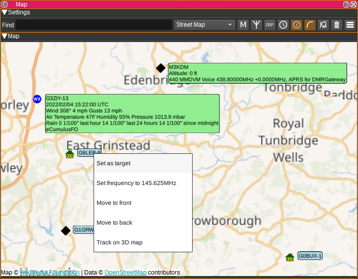
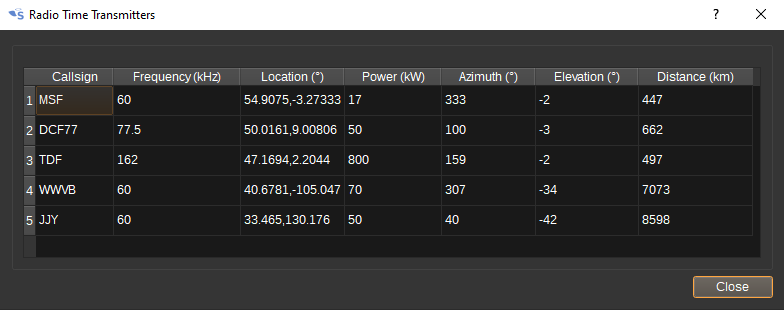

<h1>Map Feature Plugin</h1>

<h2>Introduction</h2>

The Map Feature plugin displays a world map. It can display street maps, satellite imagery as well as custom map types.
On top of this, it can plot data from other plugins, such as:

* APRS symbols from the APRS Feature,
* Aircraft from the ADS-B Demodulator,
* Ships from the AIS Demodulator,
* Satellites from the Satellite Tracker,
* The Sun, Moon and Stars from the Star Tracker,
* Beacons based on the IARU Region 1 beacon database.
* Radio time transmitters.

It can also create tracks showing the path aircraft, ships and APRS objects have taken, as well as predicted paths for satellites.

<h2>Interface</h2>

<h3>1: Find</h3>

To centre the map on an object or location, enter:

* An object name.
* Latitude and longitude. This can be in decimal degrees (E.g: -23.666413, -46.573550) or degrees, minutes and seconds (E.g: 50°40'46.461"N 95°48'26.533"W or 33d51m54.5148sS 151d12m35.6400sE).
* A Maidenhead locator (E.g: IO86av).
* An address (E.g: St Katharine's & Wapping, London EC3N 4AB)

<h3>2: Map Type</h3>

Allows you to select a map type. The available types will depend upon the Map provider
selected under Display Settings (7).

<h3>3: Maidenhead locator conversion</h3>

When checked, opens the Maidenhead locator converter dialog, which allows conversion between addresses, latitude and longitude and Maidenhead locators.

<h3>4: Display Beacon dialog</h3>

When clicked, opens the Beacon dialog. Initially, no beacons will be listed. To download the IARU Region 1 beacon list, click the download button in the top right.
The beacons will then be displayed in the table and on the map.

* Double clicking in a cell in the beacon table in the Callsign or Location columns, will centre the map on that beacon.
* Double clicking on the Frequency column will set the Device center frequency.

<h3>5: Display Radio Time Transmitters dialog</h3>

When clicked, opens the Radio Time Transmitters dialog.

* Double clicking in a cell in the table in the Callsign or Location columns, will centre the map on that transmitter.
* Double clicking on the Frequency column will set the Device center frequency.

<h3>6: Display Names</h3>

When checked, names of objects are displayed in a bubble next to each object.

<h3>7: Display tracks for selected object</h3>

When checked, displays the track (taken or predicted) for the selected object.

<h3>8: Display tracks for all objects</h3>

When checked, displays the track (taken or predicted) for the all objects.

<h3>9: Delete</h3>

When clicked, all items will be deleted from the map.

<h3>10: Display settings</h3>

When clicked, opens the Map Display Settings dialog, which allows setting:

* Which data the Map will display.
* The colour of the taken and predicted tracks.
* Which Map provider will be used to source the map image.
* API keys, required to access maps from different providers.

Free API keys are available by signing up for an accounts with:

* [Thunderforest](https://www.thunderforest.com/)
* [Maptiler](https://www.maptiler.com/)
* [Mapbox](https://www.mapbox.com/)

If API keys are not specified, a default key will be used, but this may not work if too many users use it.

When OpenStreetMap is used as the provider, a custom map URL can be entered. For example, http://a.tile.openstreetmap.fr/hot/ or http://1.basemaps.cartocdn.com/light_nolabels/

<h3>Map</h3>

The map displays objects reported by other SDRangel channels and features, as well as beacon locations.

* The "Home" antenna location is placed according to My Position set under the Preferences > My Position menu. The position is only updated when the Map plugin is first opened.
* To pan around the map, click the left mouse button and drag. To zoom in or out, use the mouse scroll wheel.
* Single clicking on an object in the map will display a text bubble with additional information about the object.
* Right clicking on a object will open a context menu, which allows:
  * To set an object as the target. The target object will have its azimuth and elevation displayed in the text bubble and sent to the Rotator Controller feature.
  * Setting the Device center frequency to the first frequency found in the text bubble for the object.
  * Changing the order in which the objects are drawn, which can help to cycle through multiple objects that are at the same location on the map.

<h2>Attribution</h2>

IARU Region 1 beacon list used with permission from: https://iaru-r1-c5-beacons.org/  To add or update a beacon, see: https://iaru-r1-c5-beacons.org/index.php/beacon-update/

Mapping and geolocation services are by Open Street Map: https://www.openstreetmap.org/ esri: https://www.esri.com/ and Mapbox: https://www.mapbox.com/

Icons made by Google from Flaticon https://www.flaticon.com

<h2>API</h2>

Full details of the API can be found in the Swagger documentation. Here is a quick example of how to centre the map on an object from the command line:

    curl -X POST "http://127.0.0.1:8091/sdrangel/featureset/0/feature/0/actions" -d '{"featureType": "Map",  "MapActions": { "find": "M7RCE" }}'

And to centre the map at a particular latitude and longitude:

    curl -X POST "http://127.0.0.1:8091/sdrangel/featureset/0/feature/0/actions" -d '{"featureType": "Map", "MapActions": { "find": "51.2 0.0" }}'
