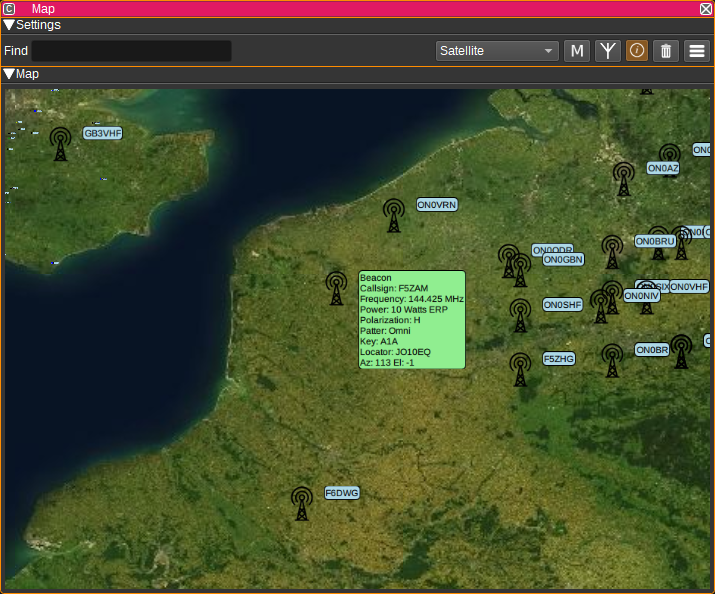

<h1>Map Feature Plugin</h1>

<h2>Introduction</h2>

The Map Feature plugin displays a world map in 2D and 3D. It can display street maps, satellite imagery as well as custom map types.
On top of this, it can plot data from other plugins, such as:

* APRS symbols from the APRS Feature,
* Aircraft from the ADS-B Demodulator,
* Ships from the AIS Demodulator,
* Satellites from the Satellite Tracker,
* Weather imagery from APT Demodulator,
* The Sun, Moon and Stars from the Star Tracker,
* Weather ballons from the RadioSonde feature,
* Beacons based on the IARU Region 1 beacon database and International Beacon Project,
* Radio time transmitters,
* GRAVES radar.

It can also create tracks showing the path aircraft, ships and APRS objects have taken, as well as predicted paths for satellites.

3D Models are not included with SDRangel. They must be downloaded by pressing the Download 3D Models button in the Display Settings dialog (11).

<h2>Interface</h2>

<h3>1: Find</h3>

To centre the map on an object or location, enter:

* An object name.
* Latitude and longitude. This can be in decimal degrees (E.g: -23.666413, -46.573550) or degrees, minutes and seconds (E.g: 50°40'46.461"N 95°48'26.533"W or 33d51m54.5148sS 151d12m35.6400sE).
* A Maidenhead locator (E.g: IO86av).
* An address (E.g: St Katharine's & Wapping, London EC3N 4AB)

<h3>2: Map Type</h3>

Allows you to select a 2D map type. The available types will depend upon the Map provider
selected under Display Settings (7).

<h3>3: Maidenhead locator conversion</h3>

When checked, opens the Maidenhead locator converter dialog, which allows conversion between addresses, latitude and longitude and Maidenhead locators.

<h3>4: Display Beacon dialog</h3>

When clicked, opens the Beacon dialog. Initially, no beacons will be listed. To download the IARU Region 1 beacon list, click the download button in the top right.
The beacons will then be displayed in the table and on the map.

* Double clicking in a cell in the beacon table in the Callsign or Location columns, will centre the map on that beacon.
* Double clicking on the Frequency column will set the Device center frequency.

<h3>5: Display IBP Beacon Project Dialog</h3>

When clicked, opens the International Beacon Project dialog. The IBP consists of 18 HF beacons around the world,
that each transmit once on each of the frequencies 14.100, 18.110, 21.150, 24.930 and 28.200MHz every 3 minutes, for 10 seconds.
The IBP dialog shows which of the beacons should currently be transmitting.

* Double clicking in a cell in the Callsign column will centre the map on that beacon.
* Double clicking in a cell in the Frequency column will set the Device center frequency.

More details of the IBP can be found at: https://www.ncdxf.org/beacon/beaconfaq.html

<h3>6: Display Radio Time Transmitters dialog</h3>

When clicked, opens the Radio Time Transmitters dialog.

* Double clicking in a cell in the table in the Callsign or Location columns, will centre the map on that transmitter.
* Double clicking on the Frequency column will set the Device center frequency.

<h3>7: Display Names</h3>

When checked, names of objects are displayed in a bubble next to each object.

<h3>8: Display tracks for selected object</h3>

When checked, displays the track (taken or predicted) for the selected object.

<h3>9: Display tracks for all objects</h3>

When checked, displays the track (taken or predicted) for the all objects.

<h3>10: Delete</h3>

When clicked, all items will be deleted from the map.

<h3>11: Display settings</h3>

When clicked, opens the Map Display Settings dialog:

The top half of the dialog allows customization of how objects from different SDRangel
plugins are dispayed on the 2D and 3D maps. This includes:

* Whether images are displayed on the 2D map and whether 3D models are displayed on the 2D map.
* Whether labels are displayed giving the name of the object.
* Whether taken and predicted tracks are displayed and in which colour.
* How the image or 3D model is scaled as the zoom level changes.

For the 2D map, the settings include:

* Whether the 2D map is displayed.
* Which Map provider will be used to source the map images.
* When OpenStreetMap is used as the provider, a custom map URL can be entered. For example, http://a.tile.openstreetmap.fr/hot/ or http://1.basemaps.cartocdn.com/light_nolabels/
* When MapboxGL is used as the provider, custom styles can be specified.

For the 3D map, the settings include:

* The terrain provider, which provides elevation data. For a "flat" globe, terrain can be set to Ellipsoid for the WGS-84 ellipsoid.
* The buildings provider, which provides 3D building models. This can be set to None if no buildings are desired.
* Whether the globe and models are lit from the direction of the Sun or the camera.
* The camera reference frame. For ECEF (Earth Centered Earth Fixed), the camera rotates with the globe.
For ECI (Earth Centred Inertial) the camera is fixed in space and the globe will rotate under it.

* API keys, required to access maps from different providers.

Free API keys are available by signing up for an accounts with:

* [Thunderforest](https://www.thunderforest.com/)
* [Maptiler](https://www.maptiler.com/)
* [Mapbox](https://www.mapbox.com/)
* [Cesium ion](https://cesium.com/ion/signup)

If API keys are not specified, a default key will be used, but this may not work if too many users use it.

The "Download 3D Models" button will download the 3D models of aircraft, ships and satellites that are required for the 3D map.
These are not included with the SDRangel distribution, so must be downloaded.

<h3>Map</h3>

The map feature displays a 2D and a 3D map overlaid with objects reported by other SDRangel channels and features, as well as beacon locations.

* The "Home Station" antenna location is placed according to My Position set under the Preferences > My Position menu. The position is only updated when the Map plugin is first opened.
* To pan around the map, click the left mouse button and drag. To zoom in or out, use the mouse scroll wheel.
* Single clicking on an object in the map will display a text bubble with additional information about the object.
* Right clicking on a object on the 2D map will open a context menu, which allows:
  * To set an object as the target. The target object will have its azimuth and elevation displayed in the text bubble and sent to the Rotator Controller feature.
  * Setting the Device center frequency to the first frequency found in the text bubble for the object.
  * Changing the order in which the objects are drawn, which can help to cycle through multiple objects that are at the same location on the map.
  * Setting the object as the tracking target on the 3D map.

The 2D map will only display the last reported positions for objects.
The 3D map, however, has a timeline that allows replaying how objects have moved over time.
To the right of the timeline is the fullscreen toggle button, which allows the 3D map to be displayed fullscreen.

<h2>Attribution</h2>

IARU Region 1 beacon list used with permission from: https://iaru-r1-c5-beacons.org/  To add or update a beacon, see: https://iaru-r1-c5-beacons.org/index.php/beacon-update/

Mapping and geolocation services are by Open Street Map: https://www.openstreetmap.org/ esri: https://www.esri.com/
Mapbox: https://www.mapbox.com/ Cesium: https://www.cesium.com Bing: https://www.bing.com/maps/

Icons made by Google from Flaticon https://www.flaticon.com

3D models are by various artists under a variety of liceneses. See: https://github.com/srcejon/sdrangel-3d-models

<h2>Creating 3D Models</h2>

If you wish to contribute a 3D model, see the https://github.com/srcejon/sdrangel-3d-models project.

<h2>API</h2>

Full details of the API can be found in the Swagger documentation. Here is a quick example of how to centre the map on an object from the command line:

    curl -X POST "http://127.0.0.1:8091/sdrangel/featureset/0/feature/0/actions" -d '{"featureType": "Map",  "MapActions": { "find": "M7RCE" }}'

And to centre the map at a particular latitude and longitude:

    curl -X POST "http://127.0.0.1:8091/sdrangel/featureset/0/feature/0/actions" -d '{"featureType": "Map", "MapActions": { "find": "51.2 0.0" }}'
