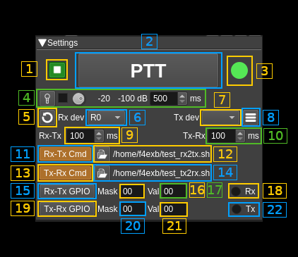

<h1>Simple PTT plugin</h1>

<h2>Introduction</h2>

This plugin controls switchover between a Rx (Device source) and Tx (Device sink). It has no other controls than an adjustable delay from Rx to Tx and back to Rx. Because of its simplicity it can also serve as a model to build other feature plugins.

<h2>Interface</h2>

<h3>1: Start/Stop plugin</h3>

This button starts or stops the plugin

<h3>2: PTT button</h3>

Click to switch from Rx to Tx and again to switch back to Rx. When in Tx mode the button is lit.

<h3>3: Status indicator</h3>

This LED type display shows the current PTT status:

  - **Green**: Rx runs
  - **Red**: Tx runs
  - **Grey**: None active (transient)

<h3>4: Vox control</h3>

<h4>4.1: Activate vox system</h4>

Toggle this switch to activate or de-activate vox control. When activated the audio input level is monitored and appears in (4.5) and if the level exceeds the level set by (4.3) and displayed in (4.4) then the vox button turns green until vox goes off after the hold period (4.6). The vox system controls the PTT only if the vox PTT enable checkbox is checked (4.2). Thus you can set the appropriate level (4.3) before engaging PTT control.

Right click on this button to open the audio input device selection dialog.

<h4>4.2: Enable PTT control</h4>

Check this box to enable PTT control by the vox system.

<h4>4.3: Vox threshold level</h4>

Use this button to adjust the vox threshold level in power dB (0 dB = full range)

<h4>4.4: Vox threshold display</h4>

This is the value set by (4.3) in dB.

<h4>4.5: Audio input level</h4>

This is the audio input level in dB displayed when the vox system is active (4.1)

<h4>4.6: Vox hold period</h4>

The vox is held active for this amount of time in milliseconds after the audio input power goes below the threshold level (4.3)

<h3>5: Refresh list of devices</h3>

Use this button to refresh the list of devices (5) and (6)

<h3>6: Select Rx device set</h3>

Use this combo to select which Rx device is controlled

<h3>7: Select Tx device set</h3>

Use this combo to select which Tx device is controlled. If no device label appears you can use the refresh button (5) to re-populate the list. Else it means that there are no Tx devices in the SDRangel instance.

<h3>8: Show last command status and log</h3>

When a transition script (11) (13) is enabled this will show the log and status of the last execution of such script.

<h3>9: Transition delay from Rx to Tx</h3>

Value in milliseconds between Rx stop and Tx start

<h3>10: Transition delay from Tx to Rx</h3>

Value in milliseconds between Tx stop and Rx start

<h3>11: Enable Rx to Tx transition script</h3>

Enable/disable execution of a transition script (12) when PTT is switched from Rx to Tx.

<h3>12: Rx to Tx transition script</h3>

Click on the button with a folder icon to open a file dialog where you can locate the script to be executed when transitioning from Rx to Tx. The full path of the script (if any) is shown next to the button.

<h3>13: Enable Tx to Rx transition script</h3>

Enable/disable execution of a transition script (14) when PTT is switched from Tx to Rx.

<h3>14: Tx to Rx transition script</h3>

Click on the button with a folder icon to open a file dialog where you can locate the script to be executed when transitioning from Tx to Rx. The full path of the script (if any) is shown next to the button.

<h3>15: Enable Rx to Tx GPIO activation</h3>

If the controlling device (Rx or Tx specified with radio buttons (18) and (22)) has GPIO support it will use the mask (16) and values (16) bits to activate the corresponding GPIO pins of the device.

<h3>16: Rx to Tx GPIO mask bits</h3>

Specify which bits of the GPIO are activated (0x00 to 0xFF) during Rx to Tx transition. Bit value 0 to ignore the bit or 1 to take it.

<h3>17: Rx to Tx GPIO value bits</h3>

Specify the value of the GPIO bits that are activated (0x00 to 0xFF) during Rx to Tx transition. Masked bit positions are ignored and can take any value.

<h3>18: Set the Rx device as taking GPIO control</h3>

You can specify either the Rx or Tx device for GPIO control. Click on this radio button to specify the Rx device.

<h3>19: Enable Tx to Rx GPIO activation</h3>

If the controlling device (Rx or Tx specified with radio buttons (18) and (22)) has GPIO support it will use the mask (20) and values (21) bits to activate the corresponding GPIO pins of the device.

<h3>20: Tx to Rx GPIO mask bits</h3>

Specify which bits of the GPIO are activated (0x00 to 0xFF) during Tx to Rx transition. Bit value 0 to ignore the bit or 1 to take it.

<h3>21: Tx to Rx GPIO value bits</h3>

Specify the value of the GPIO bits that are activated (0x00 to 0xFF) during Tx to Rx transition. Masked bit positions are ignored and can take any value.

<h3>22: Set the Tx device as taking GPIO control</h3>

You can specify either the Rx or Tx device for GPIO control. Click on this radio button to specify the Tx device.
