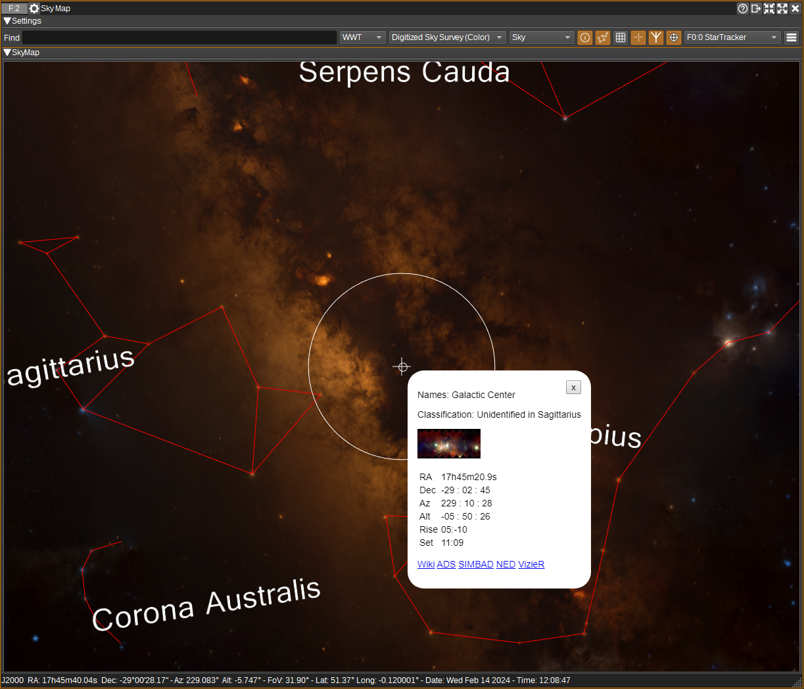
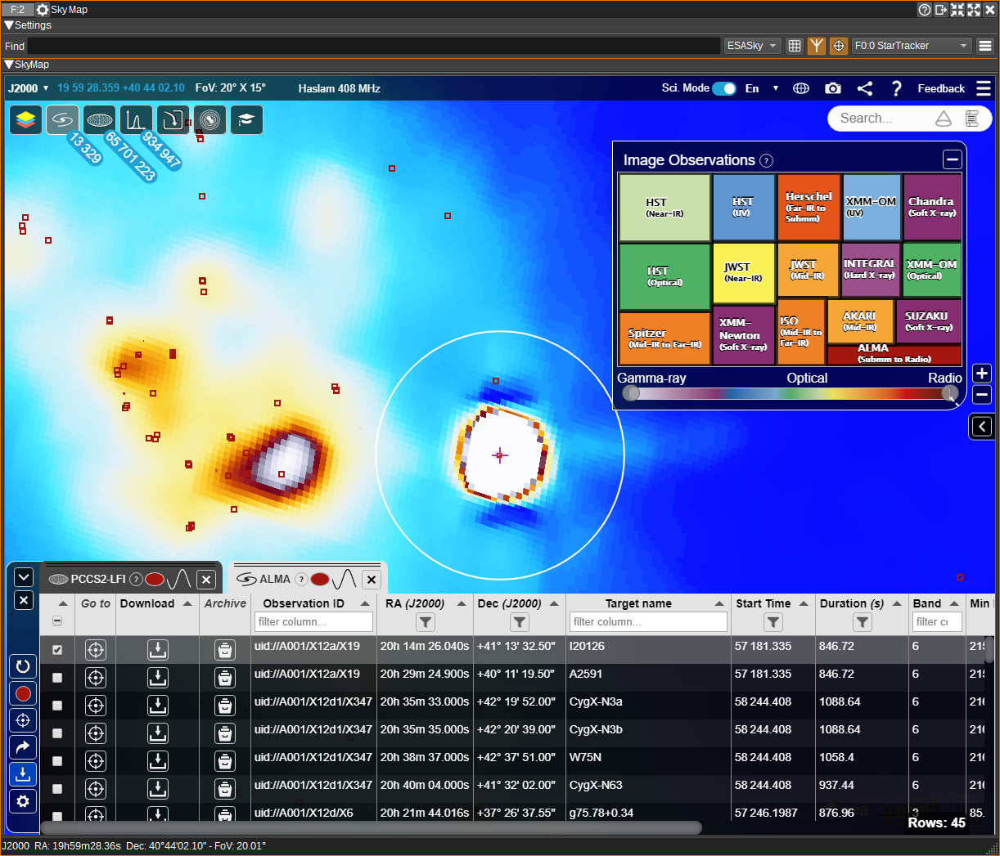
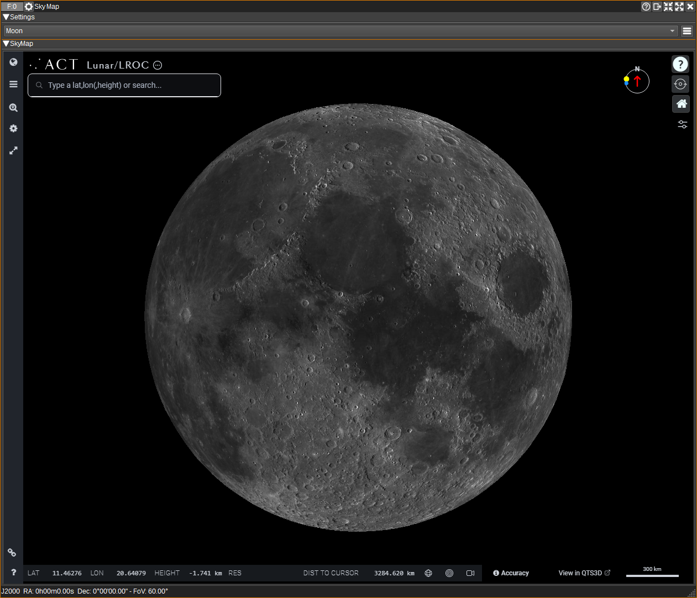

<h1>Sky Map Feature Plugin</h1>

<h2>Introduction</h2>

The Sky Map Feature provides visualization of the sky in multiple wavelengths (radio, IR, optical, UV, X-Ray, gamma).
Multiple Sky Maps are supported, including the [World Wide Telescope](https://www.worldwidetelescope.org/), [ESASky](https://www.esa.int/About_Us/ESAC/Explore_the_cosmos_with_ESASky) and [Aladin Lite](https://aladin.cds.unistra.fr/).

The Rotator Controller and Star Tracker plugins can track the position viewed in the Sky Map. The Sky Map can also be set to track coordinates from the Star Tracker, Satellite Tracker, Rotator Controller or Map.

With the ESASky map, a host of astronomical data is available from JWST, Hubble, Gaia, Herschel and others, including images, spectra and publications:

Additionally, a map of the Moon can be viewed in 2D or 3D, that supports a variety of data layers from various Lunar missions, such as LRO (Lunar Reconnaissance Orbiter).

<h2>Interface</h2>

<h3>1: Find</h3>

Enter an astronomical object name and press enter to centre the sky map on that object.

You can also enter J2000 RA and Dec coordinates, in either HMS/DMS or decimal:

* 12 05 12.23 +17 06 21.0
* 12 05 12 17 06 21
* 12:05:12.23 -17:06:21.20
* 12h05m12.23s +17d06m21.10s
* 107.1324 -34.233

Note that the supported object names depend on the chosen map (2).

<h3>2: Map Type</h3>

Allows you to select the sky map:

* WWT - World Wide Telescope 
* ESASky
* Aladin
* Moon - Map of the Moon

Each map provides different features, image and data sets.

<h3>3: Background Image Set</h3>

For WWT and Aladin, this sets the background image set the sky map will display. For ESASky, this must be set within the ESASky GUI (using the Manage Skies button), as this can use multiple image sets.

Image sets are available for a variety of wavelengths (radio, IR, optical, UV, X-Ray, gamma) from a number of different surveys.

<h3>4: Projection</h3>

For World Wide Telescope:

* Sky - Views the sky from a position on Earth, 
* Solar System - Views the Solar System, with the ability to show orbits,
* Planet - Views one of the planets or major moons.

For Aladin:

* SIN - [orthographic](https://en.wikipedia.org/wiki/Orthographic_map_projection),
* AIT - [Hammer-Aitoff](https://en.wikipedia.org/wiki/Hammer_projection),
* MOL - [Mollweide](https://en.wikipedia.org/wiki/Mollweide_projection),
* MER - [Mercator](https://en.wikipedia.org/wiki/Mercator_projection),
* ARC - zenithal/azimuthal equidistant,
* TAN - [gnomonic](https://en.wikipedia.org/wiki/Gnomonic_projection),
* HPX - [HEALPix](https://en.wikipedia.org/wiki/HEALPix).

This option is not available for ESASky, which is currently fixed to orthographic.

See [List of map projections](https://en.wikipedia.org/wiki/List_of_map_projections).

<h3>5: Display Names</h3>

For WWT, when checked, displays names of constellations and Ecliptic text (when the constellations and Ecliptic are visible).

<h3>6: Display Constellations</h3>

For WWT, this option enables the display of constellations. How the constellations are drawn can be customised in the Display Settings dialog (12).

<h3>7: Display grid</h3>

When checked, displays a coordinate grid.

For WWT, Ecliptic, Alt/Az, Equatorial and Galactic grids can be displayed. These can be selected in the Display Settings dialog (12).

For ESASky and Aladin, the grid will be Equatorial or Galactic, depending on the coordinate mode selected.

<h3>8: Display reticle</h3>

When checked, displays a reticle (cross hair) at the centre of the view. Coordinates for the reticle are displayed in the status bar in the bottom of the window.

<h3>9: Display antenna field-of-view</h3>

When checked, displays the antenna field-of-view. The antenna beamwidth can be set in the Display Settings dialog (12) or from a Star Tracker source (11).

<h3>10: Track</h3>

When checked, the centre of view will track the coordinates received from the selected Source plugin (11).

<h3>11: Source</h3>

Select a Star Tracker, Rotator Controller, Satellite Tracker or Map plugin to read viewing coordinates from.

* When a Star Tracker is selected, target RA/Dec, observation position, antenna beamwith and date/time will be read from the selected plugin.
* For other plugin types, Alt/El will be read and other parameters are taken from the the Display Settings dialog (12).

<h3>12: Display settings</h3>

When clicked, opens the Display Settings dialog. The Display Settings dialog allows the user to set:

* Observation location (latitude and longitude in degrees).
* Antenna beamwidth in degrees.
* Settings for WWT, such as how the constellations are drawn, what grids are displayed and how the Solar System view appears.

<h2>Sky Map Controls</h2>

* Click and drag using the left mouse button to rotate through right ascension or declination.
* Use the mouse wheel to zoom in and out.
* In WWT, right click to display information about the nearest astronomical object. The object will be circled and a popup information window will appear with links to relevant astronomical databases (ADS, SIMBAD, NED, VizieR). 
The popup window can be moved by left clicking and dragging it.
* In ESASky, right click to display a popup window, with links to various astronomical databases (SIMBAD, NED, VizieR) for the corresponding coordinates.
* In Aladin, right click to display a popup menu. Use the "What is this?" menu to display a window with a link to the CDS astronomical database. 

ESASky and Aladin are able to overlay catalog data:

* In ESASky, zoom in to the area of interest, then press the "Explore catalog data for this region" button. A window will appear showing available catalogs. Left click and boxes will be overlaid on the map for each catalog entry. The data is also displayed in tabular form. You can left click on a box to view its data in the table.
* In Aladin, zoom in to the areae of interest, then press the "Manage layers" button. In the popup window, select one or more of the available catalogs, or press Add catalogue to add a new one.  Boxes will be overlaid on the map for each catalog entry. Left click on a box to display the data for it in tabular form.

<h2>Attribution</h2>

WWT is from [NumFOCUS](https://worldwidetelescope.org/about/).

ESASky is from [ESAC | ESA](https://www.cosmos.esa.int/web/esdc/esasky-credits).

Aladin Sky Atlas is from [Centre de Données astronomiques de Strasbourg | CDS](https://aladin.cds.unistra.fr/).

Moon map is from [Applied Coherent Technology | ACT](https://www.actgate.com/).

Constellation icons created by Freepik - https://www.flaticon.com

<h2>API</h2>

Full details of the API can be found in the Swagger documentation. Here is a quick example of how to centre the sky map on an object from the command line:

    curl -X POST "http://127.0.0.1:8091/sdrangel/featureset/feature/0/actions" -d '{"featureType": "SkyMap",  "SkyMapActions": { "find": "polaris" }}'

And to centre the sky map at a particular RA and dec (Not for WWT):

    curl -X POST "http://127.0.0.1:8091/sdrangel/featureset/feature/0/actions" -d '{"featureType": "SkyMap", "SkyMapActions": { "find": "18 36 56 +38 47 01" }}'
