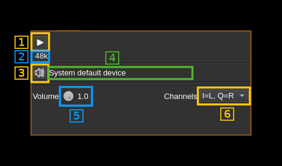

<h1>Audio CAT SISO plugin</h1>

<h2>Introduction</h2>

This MIMO plugin gets its samples from an audio device on the Rx side and sends its samples to an audio device on the Tx side. It is single stream on both Rx and Tx therefore it has "SISO" in the name. In addition it allows CAT control of a radio device using Hamlib. CAT control is limited to frequency and PTT for radios that are transceivers. You can enable or disable the Tx side. It does not use VFO-A and VFO-B to manage split operation instead it holds one frequency for Rx and one for Tx and switches the current VFO to the appropriate value according to PTT status. It is specifically designed for radios with internal audio cards but you may also connect the audio I/O of a "traditional" radio to the line in and out of a soundcard. Not a lot of radios (if any) allow true I/Q modulation through their audio in interface therefore transmission will be limited to mono audio transfer with the radio in USB mode and have limited bandwidth only on the positive frequencies of the baseband (using the negative side just switches USB to LSB).

<h2>Interface</h2>

The top and bottom bars of the device window are described [here](../../../sdrgui/device/readme.md)

<h3>1: Start/Stop</h3>

Device start / stop button. Use this switch button to play or stop audio playback

<h3>2: Audio sample rate</h3>

Audio sample rate in Hz (Sa/s) with multiplier indicator (k).

<h3>3: Select audio device</h3>

Use this push button to open a dialog that lets you choose the audio playback device. See [audio management documentation](../../../sdrgui/audio.md) for details.

<h3>4: Audio device</h3>

The name of the audio device in use.

<h3>5: Volume</h3>

A control to set the output volume. This is not supported by all output audio devices.

<h3>6: Channel Map</h3>

This controls how the left and right audio channels map on to the IQ channels.

* I=L, Q=R - The left audio channel is driven to the I channel. The right audio channel is driven to the Q channel for a complex (analytic signal)input.
* I=R, Q=L - The right audio channel is driven to the I channel. The left audio channel is driven to the Q channel for a complex (analytic signal)input.
