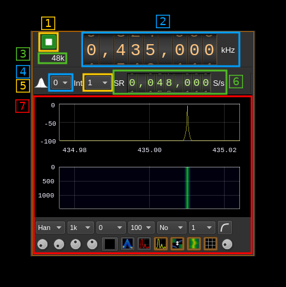

<h1>Test Multiple Output synchronized plugin</h1>

<h2>Introduction</h2>

This is a v5 only plugin.

This MO (Multiple Output) sample sink plugin sends its samples to a spectrum display. It features the synchronous pulling of samples from two baseband channels provided by a MIMO channel plugin (thus its "MO" part). Streams 0 and 1 are connected to streams 0 and 1 of the MIMO channel respectively.

<h2>Build</h2>

The plugin is always built.

<h2>Interface</h2>

<h3>1: Start/Stop</h3>

Device start / stop button.

  - Blue triangle icon: device is ready and can be started
  - Red square icon: device is running and can be stopped
  - Magenta (or pink) square icon: an error occurred

<h3>2: Frequency</h3>

This is the center frequency in kHz that will be put in the file header.

<h3>3: Output stream sample rate</h3>

This is the output stream sample rate in kS/s after interpolation (5) from the baseband stream. Thus this is the sample rate (6) multiplied by the interpolation factor (5).

<h3>4: Stream selection</h3>

This combo selects to which stream the UI applies for stream specific controls.

<h3>5: Interpolation factor</h3>

The baseband streams are interpolated by this value before being sent to spectrum display. It can vary in powers of two from 1 (no interpolation) to 64.

<h3>6: Baseband sample rate</h3>

This is the baseband sample rate before interpolation in S/s.

Use the wheels to adjust the sample rate. Left click on a digit sets the cursor position at this digit. Right click on a digit sets all digits on the right to zero. This effectively floors value at the digit position. Wheels are moved with the mousewheel while pointing at the wheel or by selecting the wheel with the left mouse click and using the keyboard arrows. Pressing shift simultaneously moves digit by 5 and pressing control moves it by 2.

<h3>7: Spectrum display</h3>

This is the final output stream spectrum display after interpolation (5). This would be sent to the hardware device. Controls on the bottom of the panel are identical to the ones of the main spectrum display.