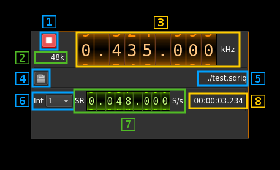

<h1>File output plugin</h1>

<h2>Introduction</h2>

This sample sink plugin sends its samples to file in the SDRangel .sdriq format.

The format is S16LE I/Q samples. Thus there are 4 bytes per sample. I and Q values are 16 bit signed integers. The file starts with a context header containing information about center frequency, sample rate and timestamp of the start of the recording. This header has a length which is a multiple of a sample size (normally 24 bytes thus 6 samples). Thus this file can be used as a raw I/Q file with S16LE samples tolerating a glitch at the start corresponding to the 6 "random" samples. For example in GNURadio you can simply specify your file source format as short complex.

You can also zap the 24 bytes header with this Linux command: `tail -c +25 myfile.sdriq > myfile.raw`

To convert in another format you may use the sox utility. For example to convert to 32 bit (float) complex samples do: `sox -r 48k −b 16 −e signed-integer -c 2 myfile.raw -e float -c 2 myfilec.raw`

Note that you have to specify the sampling rate and use .raw for the file extensions.

<h2>Build</h2>

The plugin is always built.

<h2>Interface</h2>

<h3>1: Start/Stop</h3>

Device start / stop button.

  - Blue triangle icon: device is ready and can be started
  - Red square icon: device is running and can be stopped
  - Magenta (or pink) square icon: an error occurred

<h3>2: File stream sample rate</h3>

This is the file stream sample rate in kS/s after interpolation (4) from the baseband stream. Thus this is the sample rate (7) multiplied by the interpolation factor (6).

<h3>3: Frequency</h3>

This is the center frequency in kHz that will be put in the file header.

<h3>4: Output file selection</h3>

Use this file dialog to specify the output file.

<h3>5: File name</h3>

This is the file path of the output file.

<h3>6: Interpolation factor</h3>

The baseband stream is interpolated by this value before being written to file. It can vary in powers of two from 1 (no interpolation) to 64.

<h3>7: Baseband sample rate</h3>

This is the baseband sample rate before interpolation in S/s.

Use the wheels to adjust the sample rate. Left click on a digit sets the cursor position at this digit. Right click on a digit sets all digits on the right to zero. This effectively floors value at the digit position. Wheels are moved with the mousewheel while pointing at the wheel or by selecting the wheel with the left mouse click and using the keyboard arrows. Pressing shift simultaneously moves digit by 5 and pressing control moves it by 2.

<h3>8: Time counter</h3>

This is the recording time count in HH:MM:SS.SSS
