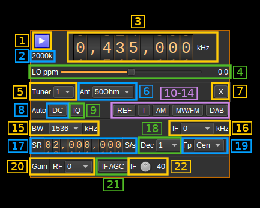

<h1>SDRplay plugin</h1>

<h2>Introduction</h2>

This plugin supports input from SDRplay RSP devices using V3 of SDRplay's API, including RSP1, RSP1A, RSP2, RSPduo and RSPdx.

<h2>Driver Prerequisites</h2>

This plugin requires the SDRplay API V3.14 to have been installed and for the service to be running. It can be downloaded for Windows, Linux and Mac from: https://www.sdrplay.com/softwarehome/

<h2>Interface</h2>

The top and bottom bars of the device window are described [here](../../../sdrgui/device/readme.md)

<h3>1: Start/Stop</h3>

Device start / stop button.

  - Blue triangle icon: device is ready and can be started
  - Green square icon: device is running and can be stopped
  - Magenta (or pink) square icon: an error occurred. In the case the device was accidentally disconnected you may click on the icon to stop, plug back in, check the source on the sampling devices control panel and start again.

<h3>2: Sample rate</h3>

This is the sample rate at which IQ samples are transferred from the device to SDRangel, in kS/s (k).

<h3>3: Center frequency</h3>

This is the center frequency of reception in kHz.

<h3>4: Local oscillator frequency correction</h3>

This is the correction in tenths of ppm steps.

<h3>5: Tuner selection</h3>

Selects which tuner is used for input. For RSPduo this can be 1 or 2. Other RSP devices only have a single tuner.

<h3>6: Antenna port</h3>

Selects which antenna port is used. The antenna ports available depend upon the RSP device and tuner selected.

<h3>7. Transverter mode open dialog</h3>

This button opens a dialog to set the transverter mode frequency translation options. The details about this dialog can be found [here](../../../sdrgui/gui/transverterdialog.md)

<h3>8: DC offset correction</h3>

Check this button to enable DC offset correction.

<h3>9: IQ imbalance correction</h3>

Check this button to enable IQ imbalance correction.

<h3>10: External reference clock output</h3>

Enable reference clock output. This is only available for RSP2 and DSPduo.

<h3>11: Bias tee</h3>

Enable bias tee. This is only available for RSP1A, RSP2, RSPduo tuner 2 and RSPdx.

<h3>12: AM notch filter</h3>

Enable AM notch filter. This is only available for RSPduo tuner 1.

<h3>13: MW/FM notch filter</h3>

Enable MW/FM notch filter. This is only available for RSP1A, RSP2, RSPduo and RSPdx.

<h3>14: DAB notch filter</h3>

Enable DAB notch filter. This is only available for RSP1A, RSPduo and RSPdx.

<h3>15: IF bandwidth</h3>

This selects the IF filter bandwidth. The following bandwidths are available:

  - 200 kHz
  - 300 kHz
  - 600 kHz
  - 1536 kHz
  - 5000 kHz
  - 6000 kHz
  - 7000 kHz
  - 8000 kHz

<h3>16: IF frequency</h3>

Warning there is no good support of non zero IF. **It is advised to keep zero IF for normal use**.

Some tricks are provided for expert use of non-zero IFs. You may want to start from these settings to experiment more with it.

This selects the IF frequency between these values:

  - **0 for zero IF**
  - 450 kHz.
    - Move center frequency by -450 kHz (3).
      - Direct frequency reading is -450 kHz off from real Rx frequency.
      - You may use the transverter mode (7) with a shift of +450 kHz to correct the frequency reading
      - If you already use the transverter mode for transverter work just add 450 kHz to the current shift
    - Use 1536 kHz bandwidth (15)
    - After sample rate change (17) you may need to start/stop device to get things right.
    - Use decimation > 1 (18) with Inf position (19)
  - 1620 kHz:
    - Move center frequency by -1620 kHz (3).
      - Direct frequency reading is -1620 kHz off from real Rx frequency.
      - You may use the transverter mode (7) with a shift of +1620 kHz to correct the frequency reading
      - If you already use the transverter mode for transverter work just add 1620 kHz to the current shift
    - Use 5000 kHz bandwidth (15)
    - After sample rate change (17) you may need to start/stop device to get things right.
    - Use decimation > 1 (18) with Inf position (19)
  - 2048 kHz:
    - Move center frequency by -2048 kHz (3).
      - Direct frequency reading is -2048 kHz off from real Rx frequency.
      - You may use the transverter mode (7) with a shift of +2048 kHz to correct the frequency reading
      - If you already use the transverter mode for transverter work just add 2048 kHz to the current shift
    - Use 5000 kHz bandwidth (15)
    - After sample rate change (17) you may need to start/stop device to get things right.
    - Use decimation > 1 (18) with Inf position (19)

<h3>17: Sample rate</h3>

Sets the ADC IQ sample rats from 2M to 10.66M Hz.

<h3>18: Decimation</h3>

Decimation in powers of two from 1 (no decimation) to 64.

<h3>19: Decimated bandpass center frequency position relative to the SDRplay center frequency</h3>

  - **Cen**: the decimation operation takes place around the SDRplay center frequency Fs.
  - **Inf**: the decimation operation takes place around Fs - Fc.
  - **Sup**: the decimation operation takes place around Fs + Fc.

With SR as the sample rate before decimation Fc is calculated as:

  - if decimation n is 4 or lower:  Fc = SR/2^(log2(n)-1). The device center frequency is on the side of the baseband. You need a RF filter bandwidth at least twice the baseband.
  - if decimation n is 8 or higher: Fc = SR/n. The device center frequency is half the baseband away from the side of the baseband. You need a RF filter bandwidth at least 3 times the baseband.

<h3>20. RF gain setting</h3>

Sets the LNA and mixer gain dB. The settings available depended upon the RSP device and frequency band.

<h3>21. IF AGC</h3>

Check this button to enable IF automatic gain control.

<h3>22. IF gain</h3>

Manual IF gain from 0 to -59 dB. Only enabled when IF AGC is disabled.
