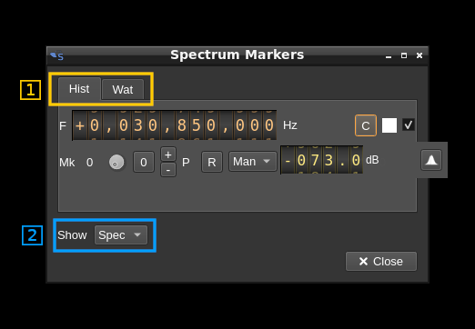
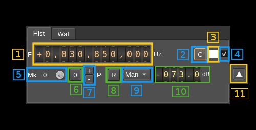
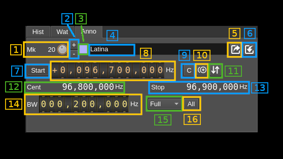

<h1>Spectrum markers management</h1>

The spectrum markers are controlled with this dialog. Note that spectrum markers will effectively show on the spectrum display only when it is active (shows some data).

<h2>General interface</h2>

<h3>1. Sub-dialog selection</h3>

The complete dialog is split into tabs:

  - **Hist** for histogram (spectrum line) markers
  - **Wat** for waterfall markers
  - **Anno** for annotation markers

<h3>2. Markers set selection</h3>

This lets you selects which markers are displayed

  - **None**: no markers are displayed
  - **Spec**: spectrum markers (histogram and waterfall) are displayed
  - **Anno**: spectrum annotations are displayed

<h2>Histogram markers tab</h2>

<h3>1. Marker frequency</h3>

Use this frequency dial to set the marker frequency in Hz

<h3>2. Center marker frequency</h3>

Push this button to move the marker at the center of the current spectrum

<h3>3. Marker color</h3>

The marker color is displayed here. You can click on the square to open a standard color selection dialog to select the marker color. Note that it selects the color of the text display of the marker the crosshairs remain in white color.

<h3>4. Marker show</h3>

Toggles marker display on the spectrum

<h3>5. Marker selection</h3>

Turn the dial button to select the marker being set up. The index of the marker appears at left.

<h3>6. Swap marker with reference marker (index 0)</h3>

Push this button to swap the current marker with marker at index 0. The marker at index 0 is the reference marker. Note that the colors are not swapped so that the marker color is associated to its index and not the marker itself.

<h3>7. Add/Remove marker</h3>

  - Press the "+" button to add a new marker with a maximum of 4 markers.
  - Press the "-" button to remove the current marker. When reference marker (index 0) is removed the marker at index 1 if it exists replaces it and thus is made the reference marker.

<h3>8. Power hold reset</h3>

When the power max hold is selected (9) this button resets the max hold

<h3>9. Marker type</h3>

This combo lets you select the type of marker:

  - **Man**: manual power set. The value is set with the next control (10)
  - **Cur**: current power. The marker will move according to the current power at the marker frequency
  - **Max**: max hold. The marker will move according to the maximum power at the marker frequency. Use button (8) to reset.

<h3>10. Manual (fixed) power</h3>

Use this slider to adjust the power position of the marker. The units are in dB irrespective of the linear or log set of the spectrum display.

<h2>Waterfall markers tab</h2>

<h3>1. Marker frequency</h3>

Use this frequency dial to set the marker frequency in Hz

<h3>2. Center marker frequency</h3>

Push this button to move the marker at the center of the spectrum

<h3>3. Marker color</h3>

The marker color is displayed here. You can click on the square to open a standard color selection dialog to select the marker color. Note that it selects the color of the text display of the marker the crosshairs remain in white color.

<h3>4. Marker show</h3>

Toggles marker display on the spectrum

<h3>5. Marker selection</h3>

Turn the dial button to select the marker being set up. The index of the marker appears at left.

<h3>6. Swap marker with reference marker (index 0)</h3>

Push this button to swap the current marker with marker at index 0. The marker at index 0 is the reference marker. Note that the colors are not swapped so that the marker color is associated to its index and not the marker itself.

<h3>7. Add/Remove marker</h3>

  - Press the "+" button to add a new marker with a maximum of 4 markers.
  - Press the "-" button to remove the current marker. When reference marker (index 0) is removed the marker at index 1 if it exists replaces it and thus is made the reference marker.

<h3>8. Time mantissa</h3>

The time mark of the marker is given in seconds by mantissa M and exponent E so that t(s) = M &times; 10E. This part controls the mantissa component M that appears on the left. The slider lets you control the decimal part from .000 to .999 and the dial button the integer part from 0 to 9.

<h3>9. Time exponent</h3>

This slider lets you control the exponent part E of the time mark so that t(s) = M &times; 10E. The value in exponential notation appears on the left.

<h2>Annotation markers tab</h2>

<h3>1. Marker selection</h3>

Turn the dial button to select the marker being set up. The index of the marker appears at left.

<h3>2. Add/Remove marker</h3>

  - Press the "+" button to add a new marker.
  - Press the "-" button to remove the current marker.

<h3>3. Marker color</h3>

The marker color is displayed here. You can click on the square to open a standard color selection dialog to select the marker color. Note that it selects the color of the text display of the marker the crosshairs remain in white color.

<h3>4. Marker text</h3>

Type in the text of the marker to be displayed when it is selected (see "Annotations on spectrum display" next). You can enter up to 36 characters.

<h3>5. Export markers to .csv file</h3>

Export the markers to a .csv file. Colums are
  - **Start**: start frequency in Hz
  - **Width**: width in Hz
  - **Text**: marker text when selected
  - **Show**: marker show state (see 15)
    - **0**: hidden
    - **1**: top area or line
    - **2**: full display
  - **Red**: red component (0..255) of marker color
  - **Green**: green component (0..255) of marker color
  - **Blue**: blue component (0..255) of marker color

The column names appear in the first line (header) of the file

<h3>6. Import markers from .csv file</h3>

Import the markers from a .csv file in the format described above.

<h3>7. Select start or Center input frequency</h3>

Use this button to select whether the input frequency next (9) should apply to marker start or center frequency

<h3>8. Input marker frequency</h3>

Enter either start or center marker frequency in Hz depending on the Start/Center button selection (8)

<h3>9. Select central frequency display</h3>

Click on this button to set the input frequency (9) to the center frequency of the spectrum

<h3>10. Duplicate marker</h3>

Duplicate the current marker in a new marker

<h3>11. Sort markers</h3>

Sort markers  by increasing starting frequency

<h3>12. Show start/center frequency</h3>

The start of center frequency in Hz is displayed when the center or start inpu frequency (8) is selected respectively.

<h3>13. Show stop frequency</h3>

Displays the stop frequency of the marker in Hz

<h3>14. Marker bandwidth</h3>

Sets the bandwidth of the marker in Hz

<h3>15. Marker show state</h3>

Select how the marker is displayed

  - **Hidden**: marker is hidden
  - **Top**: only the top area or line is displayed
  - **Full**: marker is displayed in full with line limits and text

<h3>16: Apply show state to all</h3>

Click on this button to apply the current marker show state (15) to all markers

<h3>Annotations on spectrum display</h3>

In "top" state the markers are displayed as short lines or thin areas on the top of the spectrum. Click in the marker area to toggle between "full" and "top" states. For line markers (bandwidth 0 Hz) click close to the right of line marker.
